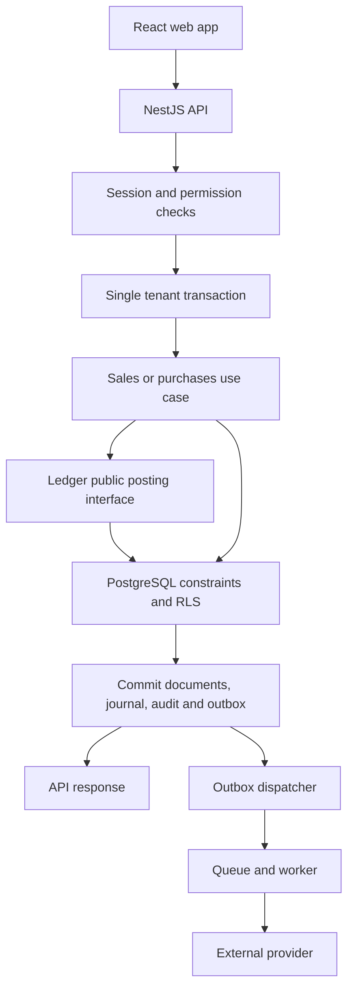

# Study report — Australian cloud accounting platform

**Date:** 9 October 2026 (Australia/Sydney). **Status:** planning draft; awaiting human approval. No production code, migrations, infrastructure or external applications have been changed. SQL below is a design artefact, not a tested migration.

**Documents read completely:** `Pasted markdown.md` is the supplied **AGENTS.md**, version 9 Oct 2026, sections 1–16, including every table and the section 15 template. `Pasted markdown (2).md` is **BUILD_PLAN.md**, version 9 Oct 2026, sections 1–9. References below use those canonical names. Their escaped Markdown should be normalised when humans approve repository setup, preserving meaning. No reference accounting repositories were cloned or studied.

## 1. Understanding summary

- Build an Australian accounting product that competes on useful automation, local workflows, price and multilingual documents; competitor pricing claims still need validation.
- Begin with a NestJS/strict-TypeScript modular monolith, React web client, PostgreSQL, and a separate worker process sharing backend use cases.
- Flutter arrives later; reserve its folder now without building the app.
- Domain rules remain framework-free; modules expose public interfaces rather than sharing internal repositories.
- Only the ledger writes journals; a document transition, posting, audit record and outbox event commit together.
- Every committed journal must contain at least two lines and balance by transaction currency; base-currency balancing must also be explicit.
- Posted journals are permanent. Corrections create linked reversing entries; balances are computed from posted lines.
- Money uses integer minor units or exact decimals, never binary floating-point amounts, including in browser code and JSON.
- Tax configurations are dated, sourced data; accountant-approved calculation examples govern implementation.
- A session selects one organisation. Application predicates and PostgreSQL RLS enforce that boundary in requests and jobs.
- Period locks, MFA, permissions, append-only audit, idempotency and concurrency controls are foundational features.
- External work happens after commit through an outbox and retry-safe workers; AI offers suggestions requiring human decisions.
- Foundation includes contacts/ABN lookup, quotes/invoices/credits/recurring documents, bills/expenses and the web app—not just a ledger demo.
- The planner writes briefs; builders implement isolated PRs; test, security and quality reviewers independently challenge the work. Product approves briefs, tech lead approves merges, adviser approves accounting, and humans trigger production changes.
- Phase gates control progression. Month 8 is an estimate contingent on staffing, pilot evidence, security and integration approvals, not a promised launch date.

## 2. Golden rules acknowledgement

| # | Acknowledgement in my words | Concrete mistake prevented |
|---|---|---|
| 1 | Commit only balanced journals; never alter posted history. | Changing a posted invoice journal's revenue line without its receivable line. |
| 2 | Fix the underlying issue without weakening security or types. | Removing an authorisation guard to unblock an invoice screen. |
| 3 | Keep each business-data query inside one authenticated tenant. | An accountant search returning another client's unpaid bills. |
| 4 | One focused task per PR, approximately 400 changed non-test, non-generated lines maximum. | A 4,000-line invoicing feature hiding a migration defect. |
| 5 | Prove behaviour with meaningful tests and preserve existing passing tests. | Fixing rounding while silently breaking negative credit notes. |
| 6 | Use supplied, approved official rules and documented provider contracts. | Guessing a BAS label or constructing an undocumented ABR field. |
| 7 | Do not reuse code from the prohibited licence families. | Pasting a restricted reference project's journal SQL into a migration. |
| 8 | Agents stay in isolated branches and sandboxes, away from production access. | An agent running a data-repair statement against customer books. |
| 9 | Justify every dependency with licence, download and release evidence in its PR. | Adding an abandoned PDF package without checking its licence. |
| 10 | Expose assumptions and seek review instead of burying guesses. | Assuming all currencies have two minor digits. |
| 11 | Report unsuccessful, omitted and unfinished verification accurately. | Claiming RLS passed when tests connected as database owner. |

## 3. Gaps, conflicts and risks

Priority: **P0** blocks the affected Phase 1 implementation; **P1** must be resolved before pilot; **P2** affects later scope/launch. A blocked accounting task does not prevent approved repo-only work.

| ID / priority | Section | Issue | Why it matters | Suggested fix |
|---|---|---|---|---|
| R01 P0 | AGENTS §§1,4 | Mutable drafts versus every journal always balanced; empty journal creation is unspecified. | Deferred checks cannot safely ignore drafts if the golden rule covers all entries. | Commit only balanced ledger drafts; incomplete editing belongs in document drafts. Adviser approves this boundary. |
| R02 P0 | AGENTS §4 | Per-currency balance does not imply base balance; FX-only revaluation conflicts with mandatory transaction amounts. | Multi-currency journals can balance in one representation and fail another. | Require both balances. Phase 1 one currency per journal, equal to organisation base; reserve FX columns; explicit later FX ADR. |
| R03 P0 | AGENTS §4 | Generic half-even default is not a complete tax rounding specification. | Invoice-level, line-level and negative adjustment results can differ. | Adviser supplies sourced policies and fixtures for each calculation path before tax code. ATO tax-invoice guidance has a rounding section: collect it, do not infer a universal rule. |
| R04 P0 | AGENTS §§3,5,7 | RLS organisation setting is trusted input to the DB, not authentication. | Any compromised shared DB connection able to set another org can bypass this boundary. | Server validates session/membership before SET LOCAL; no client SQL access; least privileges, separate identity provisioning path and adversarial tests; document this trust limit. |
| R05 P0 | AGENTS §§3,5 | “Every query exactly one tenant” leaves global identities, tenant discovery, bootstrap and worker enumeration undefined. | Login and first-organisation creation can otherwise require undocumented bypasses. | Use IdP identity plus tenant-local users; control-plane directory contains routing metadata only. Approve explicit control-plane exception, not a wildcard financial query. |
| R06 P0 | AGENTS §5 | A foreign key on account_id alone does not guarantee the account belongs to the line's organisation. | RLS alone does not make cross-tenant references safe. | Composite tenant+ID foreign keys throughout, including actor and reversal references. |
| R07 P0 | AGENTS §§4,5 | No locking protocol for line edits, final posting, reversal or period closure. | Concurrent sessions can pass checks independently and corrupt decisions. | All mutations lock journal header first; posting locks period; consistent lock ordering and deadlock retry; test independent DB connections. |
| R08 P0 | AGENTS §§3,6 | All write endpoints accept keys, but only money POSTs require them; response retention is 24h. | Late retries can duplicate postings after the response cache expires. | Require keys for state-changing commands; define request fingerprint/conflict semantics; permanent source-event uniqueness separate from response retention. |
| R09 P0 | AGENTS §§3,5 | Shared business transaction versus prohibition on querying other modules' tables. | Each module can accidentally start an independent transaction. | Shared opaque UnitOfWork passed through public module interfaces; repositories use that connection. Reporting reads ledger exports/views owned by ledger. |
| R10 P0 | BUILD §§1,4,5 | Multi-currency promised on every plan but scheduled Phase 3, after paid MVP. | Marketing and architecture expectations diverge. | Product decides AUD-only pilot/MVP disclosure or brings FX forward with budget change; draft assumes AUD-only Phase 1. |
| R11 P0 | BUILD §§4,5; AGENTS §4 | GST/BAS module starts Phase 2, while taxable invoices/bills start Phase 1. | Foundation cannot safely issue tax invoices without tax rules. | Bring dated tax codes and calculation kernel into Phase 1; BAS reporting/lodgement remains Phase 2. |
| R12 P0 | BUILD §§4,5 | “Invoicing” includes quotes, credit notes, recurring and templates; “expenses” includes claims/OCR, without scope caps. | Four months becomes unrealistic if every subfeature is assumed complete. | Confirm exact pilot scope; backlog below includes them in small slices; OCR is a separate approval gate and may be explicitly deferred. |
| R13 P1 | BUILD §§4,5,7 | Peppol is Phase 4 in module map, Phase 3 in roadmap; access-point partnership versus accreditation unclear. | Staffing and onboarding start at different times. | One schedule and a documented partner-versus-own-access-point choice. |
| R14 P1 | BUILD §§4,9 | Payroll specialist starts Phase 4 but owns Phase 3 registration/design; import tool and accountant hub arrive late despite switching strategy. | Dependencies lack an owner; pilots cannot bring opening books. | Assign early adviser hours; add opening balances/CSV import now, keep full Xero migration later. |
| R15 P1 | BUILD §§5,9; AGENTS §16 | DSP approval is a Phase 2 exit gate while manual BAS is described as approval-delay fallback. | Fallback cannot satisfy the unchanged gate. | Human-approved alternate release gate tied to exact enabled services; no implied approval waiver. |
| R16 P1 | BUILD §5; AGENTS §16 | Phase 1 pilot gate is one month; public launch also requires one BAS period. | Calendar time cannot be compressed by adding agents. | Start pilot early enough for both; reconcile sequential gates and due-date blackout calendars. |
| R17 P0 | AGENTS §9 | “No data loss ever” conflicts with up to five-minute RPO. | Unachievable assurance may become contractual. | Approve explicit recovery objectives per failure mode and customer wording; acknowledged transactions versus region catastrophe distinguished. |
| R18 P0 | AGENTS §§7,9,12 | Sydney-only data versus second Australian region backups and “approved” AI handling. | Identity, email, logs, support and AI subprocessors can violate residency promise. | Define Australian regions, subprocessors and permitted support access in a data-flow ADR; no overseas exception presumed. |
| R19 P1 | AGENTS §§2,9 | Human-triggered infrastructure changes versus automatic staging deploy on merge. | An agent can indirectly trigger infrastructure mutation. | Human-approved IaC plan/apply; application staging deployments only after human merge, with explicit environment policy. |
| R20 P1 | AGENTS §§5,9,11 | Reversible migrations, realistic “copy” and zero customer data in tests conflict if interpreted literally. | Rollback can destroy issued records; production data could enter CI. | Synthetic production-shaped datasets; expand/contract and forward repair, never destructive financial rollback. |
| R21 P1 | AGENTS §§5,8 | Index every WHERE/ORDER column is too broad; all large reports on replica creates freshness ambiguity. | Excess indexes slow posting; replica lag changes visible totals. | Index measured access paths; define report snapshot/as-of watermark and read-your-write policy. Seek amendment, not silent exception. |
| R22 P1 | AGENTS §§8,11 | CI performance gate versus nightly schedule; INP cannot be established by ordinary Lighthouse page-load alone. | Non-reproducible gates either block all work or miss regressions. | PR targeted budgets, nightly full workloads, browser interaction tests and production RUM; approve exact methodology. |
| R23 P1 | AGENTS §§8,9 | Scale is not a workload model; “2x peak” at 100,000 tenants and 10m lines each is ambiguous. | CI cost and capacity claims are unknowable. | Specify tenant distribution, large-tenant count, concurrent writers, report mix, fixture size and hardware. |
| R24 P1 | AGENTS §§4,5,8 | Nightly cache checks and synchronous rollups lack ownership/versioning; BUILD says no module stores balances. | Derived totals can drift or count drafts. | Ledger-owned rebuildable posted-only rollups; version and watermark; compare independently every night. |
| R25 P1 | AGENTS §§5,7,13 | Full audit before/after versus sensitive-data restrictions and retention/deletion requests. | Audit may become an unbounded secondary PII database. | Field allowlists, encrypted financial snapshots where required, IP/device minimisation, legal holds and retention matrix. |
| R26 P0 | BUILD §4; AGENTS §3 | Payments, e-invoicing, accountant hub and FX do not map to the 14 backend domains; billing may mean subscription billing. | Ownership and dependency cycles emerge. | Payments initially banking/payment adapters, FX ledger, Peppol sales/purchases adapters, hub reporting+identity; billing exclusively platform subscription. ADR before adding modules. |
| R27 P1 | BUILD §4 | “AU standard chart of accounts” and “AU report formats” identify no authoritative taxonomy. | Invented mandatory standard can distort customer books. | Adviser approves a versioned small-business template and mappings; distinguish template from statutory standard. |
| R28 P1 | AGENTS §15 | Example caps credit note to invoice balance. | An already paid invoice has zero due but may still need a credit/refund. | Adviser defines creditable original amount net prior credits separately from unpaid amount; do not copy example as universal rule. |
| R29 P1 | AGENTS §§6,7 | Open partner API “day one” lacks client registration, scopes, revocation and support scope. | Public API adds security and maintenance commitments before MVP. | Include minimal OAuth/scopes in Foundation or explicitly amend launch promise. |
| R30 P0 | AGENTS §§7,14; BUILD §3 | Redis version/licence, IaC tool licence, scanners and identity feature costs not pinned. | Tooling can violate licence policy or residency/budget requirements. | Version-specific dependency register; propose Valkey via ADR; distinguish using a scanner from copying its code. |
| R31 P1 | BUILD §§2,9 | Clone-first checklist conflicts with record-licence-before-opening rule. “Clean room” is informal. | Licence provenance cannot be demonstrated. | Record metadata/licence and approved revision first; separate design notes; legal review before reused code. |
| R32 P1 | AGENTS §§5,7 | Uniform created/updated actor columns lack system actor and bootstrap semantics. | Workers fake a human identity or FK cycles block onboarding. | Tenant service principals; controlled first actor bootstrap; immutable audit stamps; retain deactivated actor rows. |
| R33 P1 | AGENTS §§4,6 | No accounting sequence, manual receipt allocation, retained earnings, opening balance or document void policy. | Pilots cannot complete a month's real books with unpaid invoices alone. | Adviser approves controls and posting matrices; include manual receipt/payment entry without bank feeds. |
| R34 P1 | BUILD §§6,9 | Part-time adviser and one tech lead review every accounting change; DevOps is shared, not allocated. | Review queue and on-call become critical-path bottlenecks. | Named deputies, reserved review hours and measured throughput; agents do not replace accountable humans. |
| R35 P1 | AGENTS §§7,12 | Zero retention and no training are different provider commitments; model accuracy alone is insufficient. | Prompts/receipts can leave Australia; high-confidence errors still mispost if auto-accepted. | Contract/data-flow review; model evaluations by risk slice; explicit user approval, no confidence-triggered autonomous posting. |
| R36 P1 | AGENTS §§4,5 | Tax history, account reclassification and organisation base-currency changes lack freeze rules. | Old reports change without journal edits. | Freeze used tax versions and relevant posting classifications; prohibit base change after first posting; adviser-defined restatement workflow. |
| R37 P2 | BUILD §§1,6; AGENTS §16 | Unlimited volume, low pricing, bank/AI costs, pentest and DR have no cost model. | Paid launch may lose money even if functionality works. | Model per-tenant/storage/provider costs and support capacity before pricing commitment. |
| R38 P1 | AGENTS §§7,16 | ASVS level promises and “every finding blocks” lack version/control mapping and evidence owner. | Passing scans is confused with verified ASVS coverage. | Pin standard version, applicability/evidence matrix, independent penetration test and explicit human risk handling. |

**Schedule judgement:** four months is plausible only for an agreed narrow pilot with a staffed team and rapid adviser review. The full module-map interpretation plus all security/DR/public-API requirements is not a defensible four-month commitment yet. Month 8 paid launch is conditional; no independent evidence currently establishes team availability, provider approvals or delivery velocity.

## 4. Open questions for humans

“Blocks Phase 1” means the specified work cannot start or be accepted until answered; repo and research can proceed when their own briefs are approved.

### Product lead — Anujan

1. **BLOCKS Phase 1 scope:** Which exact Foundation features are mandatory: quotes, recurring, credits, expense approvals, receipt OCR, partner API and manual payments? Approve the baseline in section 7 or name deferrals.
2. **BLOCKS Phase 1 currency contract:** Is an AUD-only pilot acceptable with multi-currency enabled in Phase 3, and may public pricing say this explicitly?
3. **BLOCKS Phase 1 resourcing:** Who are the named tech lead, CPA/CA adviser and DevOps owner, and what weekly review/on-call capacity and AWS/security budget are committed?
4. **BLOCKS live pilot:** Which 3–5 businesses, entity types, GST methods, opening dates, data volumes and success criteria are in scope? Is the pilot parallel bookkeeping or the legal system of record?
5. **BLOCKS live pilot:** Approve Australian-region/subprocessor policy, retention/privacy ownership and customer terms; who can give legal advice where needed?
6. **Before Phase 2:** Can launch be report-only if ATO integration is delayed, and what revised phase gate and customer wording is authorised?
7. **Before Phase 3:** Resolve Peppol timing, early payroll specialist funding, and whether practice/import features move earlier.

### Tech lead / security and operations owner

1. **BLOCKS Phase 1 identity and tenancy:** Approve IdP/provider, tenant bootstrap/routing exception and actor model; how is a user's active organisation verified and switched?
2. **BLOCKS Phase 1 schema:** Approve transaction isolation, parent/period locking, SQL constraint-trigger strategy, controlled posting privilege, database major version and migration tool.
3. **BLOCKS Phase 1 queue/infrastructure:** Approve Valkey versus a specifically licensed Redis version, Sydney hosting, second-region recovery design, IaC tool and Keycloak operational ownership.
4. **BLOCKS Phase 1 safety claims:** Is regional RPO <=5 minutes the promise, or is synchronous zero-loss durability required? Fund and test the chosen target.
5. **BLOCKS API release:** Which external OAuth clients, scopes, rate limits, API support SLA and webhook features are needed in Foundation?
6. **BLOCKS pilot acceptance:** What hardware/workload defines p95 budgets, query-count scope, replica freshness and monthly restore acceptance?
7. **Before code reuse:** Who approves licence provenance and clean-room procedure, including scanners and transitive dependencies?

### Accountant adviser (with product lead for commercial scope)

1. **BLOCKS Phase 1 Money/tax:** Approve sourced rounding and tax-inclusive/exclusive calculation order, unit-price precision, tax residual limits and signed examples. May a rounding account ever conceal a discrepancy, and what amount must reject instead?
2. **BLOCKS Phase 1 ledger:** Approve chart template, normal balance/report classifications, balanced drafts, opening balances, reversal policy, period-unlock workflow and current-year earnings treatment.
3. **BLOCKS Phase 1 sales/purchases:** Approve posting matrices for invoices, bills, credit notes, voids, receipts, supplier payments, overpayments, partial allocations and expense reimbursement. How is a paid invoice credited?
4. **BLOCKS Phase 1 tax schema:** What dated registration/settings history and payment-allocation evidence must Phase 1 capture for cash/accrual BAS later?
5. **BLOCKS pilot:** Which official rules/fixtures and retention obligations apply to selected businesses, including exceptions and non-GST businesses?
6. **Before Phase 2:** Which BAS labels, adjustments, corrections and lodgement authorisations are supported, and what exact adviser evidence constitutes sign-off?

## 5. Architecture proposal for Phase 1

### Repository skeleton

Proposed final Foundation layout, following AGENTS §14. Braced alternatives enumerate actual planned sibling paths, not a new framework. Future modules have documentation placeholders only. No directories below have been created as application code.

```text
/
  AGENTS.md
  CLAUDE.md                         # generated identical handbook copy; CI compares
  BUILD_PLAN.md
  STUDY_REPORT.md
  README.md
  SECURITY.md
  CODEOWNERS
  package.json
  pnpm-workspace.yaml
  pnpm-lock.yaml
  turbo.json
  .node-version
  .github/
    pull_request_template.md
    workflows/{ci,nightly,staging,release}.yml
  apps/
    api/
      package.json
      src/{main,app.module}.ts
      src/platform/{unit-of-work,tenant-context,problem-details,auth-guards}/
      src/modules/{ledger,contacts,sales,purchases,banking,tax,payroll,
                   inventory,assets,projects,reporting,ai,identity,billing}/
        public.ts
        api/
        application/
        domain/
        infrastructure/
      migrations/                   # single ordered Knex migration stream
      knexfile.ts
      test/{integration,isolation,contracts}/
    worker/
      package.json
      src/{main,outbox-dispatcher,job-router}.ts
      test/
    web/
      package.json
      src/{app,routes,features,locales}/
      test/e2e/
    mobile/
      README.md                     # Flutter deferred; tokens/contracts spec only
  packages/
    money/{package.json,src,test}/
    contracts/{package.json,openapi.yaml,generated,schemas}/
    ui/{package.json,src,.storybook}/
    config/{eslint,typescript,vitest}/
  infra/
    cdk/{bin,lib,test}/
    environments/{sandbox,staging,production}/
  docs/
    adr/{0001-phase-one-scope,0002-data-and-tenancy,0003-identity,
         0004-queue,0005-ledger-concurrency,0006-residency-and-recovery,
         0007-contract-validation,0008-module-ownership}.md
    modules/<each-domain>/MODULE.md
    compliance/{source-register,retention-matrix,control-mapping}.md
    licences/{dependencies,reference-projects}.md
    accounting/{posting-matrix,rounding-policy}.md
    fixtures/{ledger,tax,reports}/
    runbooks/{restore,incident,outbox-replay,period-unlock}.md
    tasks/<TASK-ID>.md
    help/
    CHANGELOG.md
```

**Module boundaries:** ledger owns journal tables, balances and trial-balance read interface; identity owns organisations/users/memberships; tax owns effective tax definitions; sales/purchases own business documents. The ledger validates approved tax references through a public interface; database FKs enforce identity, not authority to query another module. Infrastructure migrations are globally ordered but module-owned. Reporting consumes a ledger-owned public query interface or approved projection, never ad hoc joins into other domains. Worker imports public application interfaces; no copy of business rules.

### Library/provider choices

Recommendations, not dependency additions. Licence labels below apply to the named upstream project, not automatically to every transitive dependency, commercial extension or hosted service. Every implementation PR must record **exact version, SPDX licence, weekly downloads with retrieval date, last release date, provenance and purpose**. Those metrics have **not** been collected for this planning report; no package is approved for installation yet. Non-npm products record “not applicable” with project activity evidence rather than fabricated downloads.

| Concern | Proposed choice / licence | Reason | ADR / condition |
|---|---|---|---|
| SQL access + sole migration runner | Knex — MIT; node-postgres `pg` — MIT | Explicit transaction handles and reviewed SQL for RLS/triggers; avoid opaque ORM hooks. | ADR-0002; audit exact pg licence and versions at approval. |
| Validation | Zod — MIT | Strict schemas and decimal-string parsing shared with web. | ADR-0007: OpenAPI canonical, generated clients, CI equivalence with runtime schemas. |
| Identity | Keycloak — Apache-2.0, self-hosted in approved AU region | Provider handles OIDC/WebAuthn; deployment location controlled. | ADR-0003; MFA, step-up, recovery, breached-password integration and session lifecycle spike required; not a claim all defaults comply. |
| Queue client | BullMQ OSS — MIT | Retry/job primitives with deterministic IDs, separate worker. | ADR-0004; no assumption queue yields exactly-once execution. |
| Queue/cache server | Valkey — BSD-3-Clause | Permissive Redis-compatible candidate avoids choosing Redis licence implicitly. | ADR-0004 **changes named datastore**; compatibility/recovery test required. |
| Unit tests | Vitest — MIT | One TS test runner for pure rules and UI units. | Dependency approval, not architecture change. |
| Property tests | fast-check — MIT | Reproducible generated transaction sequences and shrinking. | Dependency approval. |
| Real database tests | Testcontainers for Node — MIT (candidate; licence page retrieval failed during study) | Exercises real PostgreSQL commits, RLS and two-session races. | Verify upstream licence before adding; no substitute in-memory database. |
| Browser tests | Playwright — Apache-2.0 | Real login, invoice issue, accessibility and navigation flows. | Dependency approval. |
| Logging | Pino — MIT | Structured logs with allowlist/redaction at source. | Dependency approval; no amounts/document bodies in app logs. |
| Tracing | OpenTelemetry JS — Apache-2.0 candidate | Correlation across requests and jobs. | Residency/exporter ADR-0006; verify pinned licence. |
| Infrastructure | AWS CDK — Apache-2.0 candidate | TypeScript IaC fits team, explicit human deployment gates. | ADR-0006; provider/cloud spend requires human action. |
| Money | First-party bigint value object, no third-party arithmetic initially | Exact minor units with explicit rational/scale operations and string serialization. | ADR-0005; accountant approves rounding policy. |

Primary project evidence checked during study: [Knex](https://github.com/knex/knex), [Zod](https://github.com/colinhacks/zod/blob/main/packages/zod/package.json), [Keycloak](https://github.com/keycloak/keycloak), [Keycloak passkey documentation](https://github.com/keycloak/keycloak/blob/main/docs/documentation/server_admin/topics/authentication/passkeys.adoc), [BullMQ](https://github.com/taskforcesh/bullmq), [Valkey](https://valkey.io/docs/topics/introduction/), [Vitest](https://github.com/vitest-dev/vitest), [fast-check](https://github.com/dubzzz/fast-check), [Pino licence](https://github.com/pinojs/pino/blob/main/LICENSE), [Playwright licence](https://github.com/microsoft/playwright/blob/main/LICENSE). These support candidate selection, not a version-specific supply-chain approval.

### Request flow (text-labelled diagram)



The API validates OpenAPI-aligned strict input and the session first. `SET LOCAL` equivalents use bound parameters inside the acquired transaction, before business queries. The use case verifies permission, claims idempotency, locks mutable document/period/header in agreed order, computes exact amounts and calls `ledger.post`. Deferred constraints execute at commit. No success response precedes commit. Outbox dispatch uses a separate tenant-scoped transaction; network calls run outside it. Publish-then-crash can duplicate delivery: consumer deduplication and provider idempotency handle that, with reconciliation for uncertain outcomes. A partner token maps to a server-validated organisation and scopes; an untrusted body cannot override it.

## 6. Core ledger data model draft

### Assumptions requiring approval

- **A01:** Application database users are tenant-local projections of an IdP `(issuer, subject)`. One human in two organisations has two local user rows. A tightly limited control-plane directory/IdP enables discovery; its exception needs ADR-0002. No global customer table is silently exempted from tenancy.
- **A02:** UUIDv7 IDs are generated by approved application infrastructure, passed as parameters and version-checked by a domain. No PostgreSQL major-version-dependent UUID generator is assumed.
- **A03:** One active role per membership initially; named role permission matrix is versioned application policy. Multiple roles/custom roles need another reviewed schema. Service principals are explicit users.
- **A04:** Every committed ledger draft is balanced. Incomplete invoice/journal-form drafts are stored outside journal tables. Posted state is terminal; reversal is a new posted entry.
- **A05:** Phase 1 enables AUD as both transaction and base currency only. Schema preserves currency and rate fields but rejects unsupported FX in the posting gateway; no usable FX feature is implied.
- **A06:** Positive amounts plus debit/credit side; base amount may be zero for future FX-only lines. Transaction amount zero is reserved for later approved FX postings; Phase 1 rejects it. Sum uses NUMERIC to avoid aggregate overflow. Rate is `NUMERIC(19,4)` per handbook, pending adviser confirmation of adequate precision; changing precision needs ADR.
- **A07:** Non-overlapping accounting periods and tax-code validity ranges use `[start,end)`; no seeded tax rates or default fiscal-year dates. A non-applicable tax code still needs approved semantics and is not guessed.
- **A08:** One full reversal per entry initially; original remains unchanged and reverse link is on new entry. Partial adjustments are separately sourced entries. Reversing a reversal requires explicit adviser policy.
- **A09:** Account class/base currency/used tax versions freeze when used; descriptive renames are audited. Tax rates use rational numerator/denominator, avoiding invented rounding/precision rules.
- **A10:** Bootstrap uses a new organisation UUID and first user UUID in one transaction, with deferred actor FKs. First user may self-reference its creator; the authenticated provisioning event is separately recorded. This is a narrow approved onboarding path, not general app INSERT permission.
- **A11:** `audit_log` and `outbox` retain requested names despite plural-table convention; document naming exception. Common created/updated fields remain present on immutable rows with equal values.
- **A12:** Audit stores redacted before/after JSON, opaque device ID and restricted IP. Access/retention require the approved matrix. Outbox payload contains tenant-local references, not credentials or full documents.
- **A13:** Financial posting source identity `(source_type,source_id,source_event)` is permanently unique when posted; API response cache is separate. Every manual action receives a stable source command ID.

### SQL DDL (review draft)

This is the proposed structural SQL. It intentionally contains no rates, production seed records, deployment credentials or provider fields. Common audit columns are fully expanded. Source document IDs are polymorphic and cannot have a single FK: source module validates existence and tenant inside the same UnitOfWork. `btree_gist` availability/licence and extension privileges require platform review.

```sql
CREATE EXTENSION IF NOT EXISTS btree_gist;
CREATE DOMAIN uuid7 AS uuid
  CHECK (substring(VALUE::text, 15, 1) = '7'
     AND substring(VALUE::text, 20, 1) IN ('8','9','a','b'));
CREATE DOMAIN currency_code AS text CHECK (VALUE ~ '^[A-Z]{3}$');
CREATE TYPE user_kind AS ENUM ('human','service');
CREATE TYPE member_role AS ENUM
  ('owner','admin','accountant','bookkeeper','payroll_admin','read_only','invoice_only');
CREATE TYPE member_state AS ENUM ('active','disabled');
CREATE TYPE account_class AS ENUM ('asset','liability','equity','income','expense');
CREATE TYPE entry_state AS ENUM ('draft','posted');
CREATE TYPE posting_side AS ENUM ('debit','credit');
CREATE TYPE period_state AS ENUM ('open','locked');
CREATE TYPE tax_treatment AS ENUM ('taxable','gst_free','input_taxed','out_of_scope');
CREATE TYPE outbox_state AS ENUM ('pending','leased','published','dead');

CREATE TABLE organisations (
  id uuid7 PRIMARY KEY,
  organisation_id uuid7 NOT NULL UNIQUE CHECK (organisation_id = id),
  legal_name text NOT NULL CHECK (length(legal_name) > 0),
  base_currency currency_code NOT NULL,
  time_zone text NOT NULL,
  fiscal_year_start_month smallint NOT NULL CHECK (fiscal_year_start_month BETWEEN 1 AND 12),
  fiscal_year_start_day smallint NOT NULL CHECK (fiscal_year_start_day BETWEEN 1 AND 31),
  version bigint NOT NULL DEFAULT 1 CHECK (version > 0),
  created_at timestamptz NOT NULL DEFAULT now(), updated_at timestamptz NOT NULL DEFAULT now(),
  created_by uuid7 NOT NULL, updated_by uuid7 NOT NULL,
  UNIQUE (organisation_id,id)
);
CREATE TABLE users (
  id uuid7 PRIMARY KEY, organisation_id uuid7 NOT NULL REFERENCES organisations(id),
  kind user_kind NOT NULL, identity_issuer text NOT NULL, identity_subject text NOT NULL,
  display_name text NOT NULL, active boolean NOT NULL DEFAULT true,
  created_at timestamptz NOT NULL DEFAULT now(), updated_at timestamptz NOT NULL DEFAULT now(),
  created_by uuid7 NOT NULL, updated_by uuid7 NOT NULL,
  UNIQUE (organisation_id,id), UNIQUE (organisation_id,identity_issuer,identity_subject)
);
CREATE TABLE memberships (
  id uuid7 PRIMARY KEY, organisation_id uuid7 NOT NULL REFERENCES organisations(id),
  user_id uuid7 NOT NULL, role member_role NOT NULL, state member_state NOT NULL,
  version bigint NOT NULL DEFAULT 1 CHECK (version > 0),
  created_at timestamptz NOT NULL DEFAULT now(), updated_at timestamptz NOT NULL DEFAULT now(),
  created_by uuid7 NOT NULL, updated_by uuid7 NOT NULL,
  UNIQUE (organisation_id,id), UNIQUE (organisation_id,user_id),
  FOREIGN KEY (organisation_id,user_id) REFERENCES users(organisation_id,id)
);
CREATE TABLE accounts (
  id uuid7 PRIMARY KEY, organisation_id uuid7 NOT NULL REFERENCES organisations(id),
  code text NOT NULL, name text NOT NULL, class account_class NOT NULL,
  normal_side posting_side NOT NULL, parent_id uuid7,
  active boolean NOT NULL DEFAULT true, postable boolean NOT NULL DEFAULT true,
  version bigint NOT NULL DEFAULT 1 CHECK (version > 0),
  created_at timestamptz NOT NULL DEFAULT now(), updated_at timestamptz NOT NULL DEFAULT now(),
  created_by uuid7 NOT NULL, updated_by uuid7 NOT NULL,
  UNIQUE (organisation_id,id), UNIQUE (organisation_id,code),
  CHECK (parent_id IS NULL OR parent_id <> id),
  FOREIGN KEY (organisation_id,parent_id) REFERENCES accounts(organisation_id,id)
);
CREATE TABLE tax_codes (
  id uuid7 PRIMARY KEY, organisation_id uuid7 NOT NULL REFERENCES organisations(id),
  code text NOT NULL, treatment tax_treatment NOT NULL,
  valid_during daterange NOT NULL,
  rate_numerator bigint NOT NULL CHECK (rate_numerator >= 0),
  rate_denominator bigint NOT NULL CHECK (rate_denominator > 0),
  source_url text NOT NULL, source_checked_on date NOT NULL,
  approval_reference text NOT NULL,
  created_at timestamptz NOT NULL DEFAULT now(), updated_at timestamptz NOT NULL DEFAULT now(),
  created_by uuid7 NOT NULL, updated_by uuid7 NOT NULL,
  UNIQUE (organisation_id,id),
  CHECK (NOT isempty(valid_during) AND NOT lower_inf(valid_during)
         AND lower_inc(valid_during) AND NOT upper_inc(valid_during)),
  EXCLUDE USING gist (organisation_id WITH =, code WITH =, valid_during WITH &&)
);
CREATE TABLE periods (
  id uuid7 PRIMARY KEY, organisation_id uuid7 NOT NULL REFERENCES organisations(id),
  accounting_dates daterange NOT NULL, state period_state NOT NULL DEFAULT 'open',
  locked_at timestamptz, locked_by uuid7,
  version bigint NOT NULL DEFAULT 1 CHECK (version > 0),
  created_at timestamptz NOT NULL DEFAULT now(), updated_at timestamptz NOT NULL DEFAULT now(),
  created_by uuid7 NOT NULL, updated_by uuid7 NOT NULL,
  UNIQUE (organisation_id,id),
  CHECK (NOT isempty(accounting_dates) AND NOT lower_inf(accounting_dates)
         AND NOT upper_inf(accounting_dates) AND lower_inc(accounting_dates)
         AND NOT upper_inc(accounting_dates)),
  CHECK ((state='locked') = (locked_at IS NOT NULL AND locked_by IS NOT NULL)),
  CHECK ((locked_at IS NULL) = (locked_by IS NULL)),
  FOREIGN KEY (organisation_id,locked_by) REFERENCES users(organisation_id,id),
  EXCLUDE USING gist (organisation_id WITH =, accounting_dates WITH &&)
);
CREATE TABLE journal_entries (
  id uuid7 PRIMARY KEY, organisation_id uuid7 NOT NULL REFERENCES organisations(id),
  state entry_state NOT NULL DEFAULT 'draft', period_id uuid7 NOT NULL,
  posting_date date NOT NULL, base_currency currency_code NOT NULL,
  source_type text NOT NULL CHECK (length(source_type)>0), source_id uuid7 NOT NULL,
  source_event text NOT NULL CHECK (length(source_event)>0),
  description text NOT NULL, reversal_of uuid7,
  posted_at timestamptz, posted_by uuid7,
  version bigint NOT NULL DEFAULT 1 CHECK (version>0),
  created_at timestamptz NOT NULL DEFAULT now(), updated_at timestamptz NOT NULL DEFAULT now(),
  created_by uuid7 NOT NULL, updated_by uuid7 NOT NULL,
  UNIQUE (organisation_id,id),
  UNIQUE (organisation_id,id,posting_date,source_type,source_id,base_currency),
  CHECK ((state='posted') = (posted_at IS NOT NULL AND posted_by IS NOT NULL)),
  CHECK ((posted_at IS NULL) = (posted_by IS NULL)),
  CHECK (reversal_of IS NULL OR reversal_of <> id),
  FOREIGN KEY (organisation_id,period_id) REFERENCES periods(organisation_id,id),
  FOREIGN KEY (organisation_id,posted_by) REFERENCES users(organisation_id,id),
  FOREIGN KEY (organisation_id,reversal_of) REFERENCES journal_entries(organisation_id,id)
);
CREATE UNIQUE INDEX journal_entries_posted_source
 ON journal_entries(organisation_id,source_type,source_id,source_event) WHERE state='posted';
CREATE UNIQUE INDEX journal_entries_one_reversal
 ON journal_entries(organisation_id,reversal_of) WHERE reversal_of IS NOT NULL;
CREATE TABLE journal_lines (
  id uuid7 PRIMARY KEY, organisation_id uuid7 NOT NULL REFERENCES organisations(id),
  journal_entry_id uuid7 NOT NULL, line_no integer NOT NULL CHECK (line_no>0),
  account_id uuid7 NOT NULL, tax_code_id uuid7 NOT NULL,
  side posting_side NOT NULL,
  transaction_minor bigint NOT NULL CHECK (transaction_minor>=0),
  transaction_currency currency_code NOT NULL,
  base_minor bigint NOT NULL CHECK (base_minor>=0), base_currency currency_code NOT NULL,
  fx_rate numeric(19,4) NOT NULL CHECK (fx_rate>0),
  posting_date date NOT NULL, source_type text NOT NULL, source_id uuid7 NOT NULL,
  created_at timestamptz NOT NULL DEFAULT now(), updated_at timestamptz NOT NULL DEFAULT now(),
  created_by uuid7 NOT NULL, updated_by uuid7 NOT NULL,
  UNIQUE (organisation_id,id), UNIQUE (organisation_id,journal_entry_id,line_no),
  CHECK (transaction_minor>0 OR base_minor>0),
  FOREIGN KEY (organisation_id,journal_entry_id,posting_date,source_type,source_id,base_currency)
    REFERENCES journal_entries(organisation_id,id,posting_date,source_type,source_id,base_currency)
    DEFERRABLE INITIALLY DEFERRED,
  FOREIGN KEY (organisation_id,account_id) REFERENCES accounts(organisation_id,id),
  FOREIGN KEY (organisation_id,tax_code_id) REFERENCES tax_codes(organisation_id,id)
);
CREATE TABLE audit_log (
  id uuid7 PRIMARY KEY, organisation_id uuid7 NOT NULL REFERENCES organisations(id),
  actor_id uuid7 NOT NULL, action text NOT NULL, entity_type text NOT NULL, entity_id uuid7 NOT NULL,
  occurred_at timestamptz NOT NULL DEFAULT now(), request_id uuid7 NOT NULL,
  ip_address inet, device_id text, before_values jsonb, after_values jsonb,
  reason text,
  created_at timestamptz NOT NULL DEFAULT now(), updated_at timestamptz NOT NULL DEFAULT now(),
  created_by uuid7 NOT NULL, updated_by uuid7 NOT NULL,
  UNIQUE (organisation_id,id),
  CHECK (created_at=updated_at AND created_by=updated_by),
  FOREIGN KEY (organisation_id,actor_id) REFERENCES users(organisation_id,id)
);
CREATE TABLE outbox (
  id uuid7 PRIMARY KEY, organisation_id uuid7 NOT NULL REFERENCES organisations(id),
  event_type text NOT NULL, schema_version integer NOT NULL CHECK (schema_version>0),
  aggregate_type text NOT NULL, aggregate_id uuid7 NOT NULL,
  dedupe_key text NOT NULL, payload jsonb NOT NULL,
  state outbox_state NOT NULL DEFAULT 'pending', available_at timestamptz NOT NULL DEFAULT now(),
  attempts integer NOT NULL DEFAULT 0 CHECK (attempts>=0),
  lease_token uuid7, lease_until timestamptz, published_at timestamptz,
  last_error_code text,
  created_at timestamptz NOT NULL DEFAULT now(), updated_at timestamptz NOT NULL DEFAULT now(),
  created_by uuid7 NOT NULL, updated_by uuid7 NOT NULL,
  UNIQUE (organisation_id,id), UNIQUE (organisation_id,dedupe_key),
  CHECK ((state='leased') = (lease_token IS NOT NULL AND lease_until IS NOT NULL)),
  CHECK ((lease_token IS NULL) = (lease_until IS NULL)),
  CHECK ((state='published') = (published_at IS NOT NULL))
);
```

Common actor FKs, tenant RLS and actor indexes are specified below without repeating identical SQL ten times. These fixed identifiers are migration literals, not untrusted runtime interpolation. Runtime actor fields are assigned by trusted infrastructure and immutable creation stamps are trigger-protected, not accepted from request bodies.

```sql
DO $migration$
DECLARE t text;
BEGIN
  FOREACH t IN ARRAY ARRAY['organisations','users','memberships','accounts','tax_codes',
                           'periods','journal_entries','journal_lines','audit_log','outbox']
  LOOP
    EXECUTE format('ALTER TABLE %I ADD FOREIGN KEY (organisation_id,created_by)
      REFERENCES users(organisation_id,id) DEFERRABLE INITIALLY DEFERRED', t);
    EXECUTE format('ALTER TABLE %I ADD FOREIGN KEY (organisation_id,updated_by)
      REFERENCES users(organisation_id,id) DEFERRABLE INITIALLY DEFERRED', t);
    EXECUTE format('CREATE INDEX %I ON %I (organisation_id,created_by)',t||'_creator',t);
    EXECUTE format('CREATE INDEX %I ON %I (organisation_id,updated_by)',t||'_updater',t);
    EXECUTE format('ALTER TABLE %I ENABLE ROW LEVEL SECURITY',t);
    EXECUTE format('ALTER TABLE %I FORCE ROW LEVEL SECURITY',t);
    EXECUTE format('CREATE POLICY tenant_isolation ON %I
      USING (organisation_id = nullif(current_setting(''app.org_id'',true),'''')::uuid)
      WITH CHECK (organisation_id = nullif(current_setting(''app.org_id'',true),'''')::uuid)',t);
  END LOOP;
END $migration$;
CREATE INDEX accounts_parent ON accounts(organisation_id,parent_id);
CREATE INDEX periods_locker ON periods(organisation_id,locked_by);
CREATE INDEX journal_entries_period ON journal_entries(organisation_id,period_id,posting_date,id);
CREATE INDEX journal_entries_poster ON journal_entries(organisation_id,posted_by);
CREATE INDEX journal_entries_date ON journal_entries(organisation_id,posting_date,id) WHERE state='posted';
CREATE INDEX journal_lines_account ON journal_lines(organisation_id,account_id,posting_date,id);
CREATE INDEX journal_lines_tax ON journal_lines(organisation_id,tax_code_id,posting_date,id);
CREATE INDEX audit_log_entity ON audit_log(organisation_id,entity_type,entity_id,occurred_at,id);
CREATE INDEX audit_log_actor ON audit_log(organisation_id,actor_id,occurred_at,id);
CREATE INDEX audit_log_date ON audit_log(organisation_id,occurred_at,id);
CREATE INDEX outbox_ready ON outbox(organisation_id,available_at,id) WHERE state='pending';
CREATE INDEX outbox_expired_lease ON outbox(organisation_id,lease_until,id) WHERE state='leased';
CREATE INDEX outbox_aggregate ON outbox(organisation_id,aggregate_type,aggregate_id);
```

### Balance, immutability and concurrency enforcement

A row CHECK cannot aggregate sibling lines. Use immediate mutation guards plus deferred constraint triggers on **both headers and lines**, including inserts, updates and deletes. Empty headers are therefore checked, not merely line modifications. PostgreSQL documents deferred constraint triggers and RLS separately: [CREATE TRIGGER](https://www.postgresql.org/docs/current/sql-createtrigger.html), [row security](https://www.postgresql.org/docs/current/ddl-rowsecurity.html).

The aggregate validator below is design SQL. The guard/privilege work described immediately after it is mandatory; this fragment alone is **not** a complete protected posting implementation.

```sql
CREATE FUNCTION check_journal_balance() RETURNS trigger
LANGUAGE plpgsql AS $$
DECLARE o uuid; j uuid; n bigint; net numeric;
BEGIN
  IF TG_TABLE_NAME='journal_entries' THEN
    IF TG_OP='DELETE' THEN o:=OLD.organisation_id; j:=OLD.id;
    ELSE o:=NEW.organisation_id; j:=NEW.id; END IF;
  ELSE
    IF TG_OP='DELETE' THEN o:=OLD.organisation_id; j:=OLD.journal_entry_id;
    ELSE o:=NEW.organisation_id; j:=NEW.journal_entry_id; END IF;
  END IF;
  -- Immediate guards prohibit moving an existing line to another header/tenant.
  -- Header is locked by every writer before mutation, and again here defensively.
  PERFORM id FROM journal_entries WHERE organisation_id=o AND id=j FOR UPDATE;
  IF NOT FOUND THEN RETURN NULL; END IF; -- only a permitted deleted draft
  SELECT count(*), coalesce(sum(CASE WHEN side='debit'
        THEN base_minor::numeric ELSE -base_minor::numeric END),0)
    INTO n,net FROM journal_lines WHERE organisation_id=o AND journal_entry_id=j;
  IF n<2 OR net<>0 THEN RAISE EXCEPTION 'invalid journal balance'; END IF;
  IF EXISTS (SELECT transaction_currency FROM journal_lines
      WHERE organisation_id=o AND journal_entry_id=j GROUP BY transaction_currency
      HAVING sum(CASE WHEN side='debit' THEN transaction_minor::numeric
                      ELSE -transaction_minor::numeric END)<>0) THEN
    RAISE EXCEPTION 'invalid currency balance';
  END IF;
  RETURN NULL;
END $$;
CREATE CONSTRAINT TRIGGER journal_header_balance
 AFTER INSERT OR UPDATE OR DELETE ON journal_entries
 DEFERRABLE INITIALLY DEFERRED FOR EACH ROW EXECUTE FUNCTION check_journal_balance();
CREATE CONSTRAINT TRIGGER journal_line_balance
 AFTER INSERT OR UPDATE OR DELETE ON journal_lines
 DEFERRABLE INITIALLY DEFERRED FOR EACH ROW EXECUTE FUNCTION check_journal_balance();
```

**Required guard contract for implementation (LEDGER-004 to LEDGER-007):**

1. BEFORE any line mutation, lock its existing parent `FOR UPDATE`, reject if posted, reject tenant/entry/line identity reassignment, and check actor. New header must begin draft; only controlled posting operation changes it to posted. Reject all UPDATE/DELETE of a posted header, including metadata; reject TRUNCATE through privileges. Deleting a draft explicitly deletes its lines first in the same transaction, no financial cascade.
2. Posting obtains the period row lock and checks `posting_date <@ accounting_dates`, open state and tenant. Lock/unlock acquires the same row lock. Possession of unlock permission does not silently bypass a lock: separate step-up-authenticated audited unlock first. Once periods contain postings, their date ranges cannot be edited.
3. After concurrent waits, re-read under READ COMMITTED; reject stale If-Match version. Header-locking serialises draft edits; posting locks involved account/tax versions to prevent simultaneous deactivation or semantic edits. Lock multiple rows by sorted ID; retries reuse idempotency key.
4. Check organisation base currency, valid timezone/calendar settings, active postable accounts, tax effective date, supported currency metadata, rate conversion and rounding bounds. For Phase 1 require `transaction_currency=base_currency='AUD'`, `transaction_minor=base_minor>0`, `fx_rate=1`. No tax rates are encoded here. Enforce account-tree acyclicity and last-owner protection in controlled operations.
5. Reversal validates original is posted and in same organisation, exact opposite accounts/tax/currencies/amounts, valid new open date, reason and unique link. Source identity is stable and persisted beyond 24h. Do not modify original entry to record reversal status; derive that status from the link.
6. Append required audit and outbox rows in the transaction; inject a failure before commit to prove all writes roll back. Database-owned audit triggers or an audited gateway must ensure callers cannot omit evidence.
7. Database roles: migration owner separate; `app_runtime`/worker are non-owner, NOSUPERUSER, NOBYPASSRLS, cannot SET ROLE to migration/posting owner. API runtime has no journal INSERT/UPDATE/DELETE/TRUNCATE grants. An explicitly reviewed `ledger_posting` NOLOGIN, NOBYPASSRLS, non-table-owner function owner provides narrowly granted posting/draft/reversal gateways. SECURITY DEFINER gateways use fixed `search_path`, no public EXECUTE, mandatory tenant/actor context and membership/permission verification; FORCE RLS remains effective. SQL injection is not solved by RLS alone.
8. App roles cannot UPDATE/DELETE/TRUNCATE audit_log. Audit insertion via controlled gateway/trigger only; worker can update outbox delivery metadata but cannot alter event identity/payload. Migrations must not routinely weaken audit protection. Administrative tamper controls and immutable archive storage need separate operations design.
9. Tenant policy fails closed on missing/blank setting, and rejects malformed UUIDs. Set organisation and actor transaction-locally with parameterised `set_config(...,true)`. Pool release/rollback tests prove no leakage. Membership permissions remain enforced even when RLS returns tenant-visible rows. Query plan/index behaviour must be measured with FORCE RLS enabled and real app roles.

**Additional required models, outside the requested core ten:** API idempotency responses (`organisation_id, principal_id, route, key, request_hash, status, response, expiry` with unique key scope); consumer inbox (`organisation_id,consumer,event_id` unique); authorised sessions/routing directory; tax registration/accounting-method history; document numbering; invoices/bills and their tax calculation snapshots; payments/allocations; attachments; ledger period rollups. These receive their own briefs. Core journal lines alone cannot reconstruct cash-basis BAS without allocations and dated tax facts. Their absence here is a scope boundary of the requested core draft, not permission to omit them from the product.

**Validation status:** DDL has been reviewed as a proposal but not executed. No claim of migration correctness, performance, RLS proof or race safety is made until the independent database tests in section 8 pass. Guards are specified, not implemented. This avoids presenting study-phase SQL as production-ready security code.

## 7. Phase 1 backlog

The briefs below use the **exact field labels/order from AGENTS §15**. Dependencies are stated in IN SCOPE to preserve that template. Each is one PR, targeting **150–350 non-test/non-generated changed lines, hard review threshold about 400**; documentation and migrations count. If implementation exceeds this, planner splits the brief and product reapproves before work. Tests are not omitted to fit the budget. Schema SQL in section 6 is intentionally split across several migrations/tasks.

All briefs are **unapproved**. Referenced official-source IDs map to section 9; a source landing page alone is not an implementation specification. A task involving tax or provider fields remains blocked until its precise current source and signed adviser/provider contract are attached. This is an explicit source gate, not permission to guess. Platform work reads `docs/modules/platform/MODULE.md` (cross-cutting documentation, not a new business module); all other paths follow their MODULE field. No production provisioning or customer messaging is authorised by these proposed briefs.

Baseline includes all Foundation module-map subfeatures, including **conditional receipt OCR**. Product may explicitly defer it, partner API or other items; that requires updating BUILD_PLAN, not quietly dropping briefs. No full bank feeds, BAS form/lodgement, automated payment execution, full reporting suite, Flutter, FX, payroll or Peppol are built in Phase 1.

Common completion gate for each brief: product-approved brief before build, relevant MODULE/OpenAPI/changelog/help updated (or documented not-applicable), all applicable CI gates green with no skipped tests, independent security and quality review, tech-lead merge approval, accountant approval for ledger/tax/financial changes, and feature flag/monitoring where required. “No endpoint” tasks still need verification appropriate to their artefact. Performance below is a target to prove, never a claimed measurement.

### REPO-001 — Establish pnpm/Turborepo skeleton and handbook copies

```text
TASK ID: REPO-001
GOAL: Establish pnpm/Turborepo skeleton and handbook copies.
MODULE: platform (read docs/modules/platform/MODULE.md first)
IN SCOPE:
  - Depends on: Approved scope ADR.
  - Establish pnpm/Turborepo skeleton and handbook copies; target 150–350 changed implementation/documentation lines.
OUT OF SCOPE:
  - Other briefs, later-phase features, production changes and guessed compliance rules.
RULES AND SOURCES:
  - AGENTS §§3,14.
  - AGENTS.md §§1,2,11,14–16; attach applicable approved ADR and source excerpt.
DATA MODEL: workspace manifests; packages/config.
ACCEPTANCE CRITERIA:
  1. Clean install and strict build succeed.
  2. Handbook copies agree.
  3. Module-boundary lint rejects a forbidden import.
TESTS REQUIRED: configuration smoke and negative import fixture; existing relevant suites remain green.
PERFORMANCE: No runtime endpoint; CI must finish within the agreed job budget.
SECURITY: No runtime endpoint; protected main and CODEOWNERS.
DONE WHEN: all CI gates green + reviewer agent + human approval;
  accountant adviser sign-off for accounting changes; common completion gate above.
```

### CI-001 — Add type/lint/format, secret and dependency gates

```text
TASK ID: CI-001
GOAL: Add type/lint/format, secret and dependency gates.
MODULE: platform (read docs/modules/platform/MODULE.md first)
IN SCOPE:
  - Depends on: REPO-001.
  - Add type/lint/format, secret and dependency gates; target 150–350 changed implementation/documentation lines.
OUT OF SCOPE:
  - Other briefs, later-phase features, production changes and guessed compliance rules.
RULES AND SOURCES:
  - AGENTS §§7,11.
  - AGENTS.md §§1,2,11,14–16; attach applicable approved ADR and source excerpt.
DATA MODEL: CI workflow; dependency register.
ACCEPTANCE CRITERIA:
  1. A seeded test secret and disallowed dependency each fail CI.
  2. Approved lockfile install is reproducible.
TESTS REQUIRED: CI negative fixtures; existing relevant suites remain green.
PERFORMANCE: No runtime endpoint; CI must finish within the agreed job budget.
SECURITY: Read-only CI token; no production credentials.
DONE WHEN: all CI gates green + reviewer agent + human approval;
  accountant adviser sign-off for accounting changes; common completion gate above.
```

### CI-002 — Add unit/property coverage and real-PostgreSQL integration harness

```text
TASK ID: CI-002
GOAL: Add unit/property coverage and real-PostgreSQL integration harness.
MODULE: platform (read docs/modules/platform/MODULE.md first)
IN SCOPE:
  - Depends on: CI-001.
  - Add unit/property coverage and real-PostgreSQL integration harness; target 150–350 changed implementation/documentation lines.
OUT OF SCOPE:
  - Other briefs, later-phase features, production changes and guessed compliance rules.
RULES AND SOURCES:
  - AGENTS §11.
  - AGENTS.md §§1,2,11,14–16; attach applicable approved ADR and source excerpt.
DATA MODEL: CI workflow; synthetic DB factories.
ACCEPTANCE CRITERIA:
  1. Coverage thresholds fail below 90% domain/80% overall.
  2. Tests connect with non-owner app role.
TESTS REQUIRED: harness smoke; failure propagation; existing relevant suites remain green.
PERFORMANCE: No runtime endpoint; CI must finish within the agreed job budget.
SECURITY: Ephemeral synthetic database only.
DONE WHEN: all CI gates green + reviewer agent + human approval;
  accountant adviser sign-off for accounting changes; common completion gate above.
```

### MONEY-001 — Define immutable Money parse/format, currency and range rules

```text
TASK ID: MONEY-001
GOAL: Define immutable Money parse/format, currency and range rules.
MODULE: ledger (read docs/modules/ledger/MODULE.md first)
IN SCOPE:
  - Depends on: CI-002; adviser approves A05/A06.
  - Define immutable Money parse/format, currency and range rules; target 150–350 changed implementation/documentation lines.
OUT OF SCOPE:
  - Other briefs, later-phase features, production changes and guessed compliance rules.
RULES AND SOURCES:
  - AGENTS §4; adviser Money contract.
  - AGENTS.md §§1,2,11,14–16; attach applicable approved ADR and source excerpt.
DATA MODEL: packages/money/src; currency metadata contract.
ACCEPTANCE CRITERIA:
  1. Decimal strings round-trip.
  2. Malformed/float inputs and cross-currency addition reject.
  3. Bigint boundaries checked.
TESTS REQUIRED: unit; 10,000 property cases; existing relevant suites remain green.
PERFORMANCE: Reads p95 <200 ms; financial writes p95 <400 ms; <=10 application queries/request; UI LCP <2.5 s where applicable. Background work benchmark separately; disclose trigger SQL cost.
SECURITY: No API; prohibit raw money numbers.
DONE WHEN: all CI gates green + reviewer agent + human approval;
  accountant adviser sign-off for accounting changes; common completion gate above.
```

### MONEY-002 — Implement exact scaled multiplication and explicit rounding-policy interface

```text
TASK ID: MONEY-002
GOAL: Implement exact scaled multiplication and explicit rounding-policy interface.
MODULE: ledger (read docs/modules/ledger/MODULE.md first)
IN SCOPE:
  - Depends on: MONEY-001; Q-adviser-1.
  - Implement exact scaled multiplication and explicit rounding-policy interface; target 150–350 changed implementation/documentation lines.
OUT OF SCOPE:
  - Other briefs, later-phase features, production changes and guessed compliance rules.
RULES AND SOURCES:
  - SRC-01 plus approved rounding-policy.md.
  - AGENTS.md §§1,2,11,14–16; attach applicable approved ADR and source excerpt.
DATA MODEL: packages/money; approved rounding fixtures.
ACCEPTANCE CRITERIA:
  1. Positive/negative ties match approved policy.
  2. Residual allocation conserves total.
  3. No binary amount conversion.
TESTS REQUIRED: property; signed golden vectors; existing relevant suites remain green.
PERFORMANCE: Reads p95 <200 ms; financial writes p95 <400 ms; <=10 application queries/request; UI LCP <2.5 s where applicable. Background work benchmark separately; disclose trigger SQL cost.
SECURITY: No rate seeds; source required before build.
DONE WHEN: all CI gates green + reviewer agent + human approval;
  accountant adviser sign-off for accounting changes; common completion gate above.
```

### LEDGER-001 — Write core posting contract and module ownership documentation

```text
TASK ID: LEDGER-001
GOAL: Write core posting contract and module ownership documentation.
MODULE: ledger (read docs/modules/ledger/MODULE.md first)
IN SCOPE:
  - Depends on: MONEY-001; ADR-0002/0005 approved.
  - Write core posting contract and module ownership documentation; target 150–350 changed implementation/documentation lines.
OUT OF SCOPE:
  - Other briefs, later-phase features, production changes and guessed compliance rules.
RULES AND SOURCES:
  - AGENTS §§3,4,6.
  - AGENTS.md §§1,2,11,14–16; attach applicable approved ADR and source excerpt.
DATA MODEL: contracts/openapi.yaml; ledger/public.ts design; MODULE.md.
ACCEPTANCE CRITERIA:
  1. Post/draft/reverse schemas reject unknown fields.
  2. Money fields are strings.
  3. Typed errors and permissions agreed.
TESTS REQUIRED: OpenAPI validation and schema fixtures; existing relevant suites remain green.
PERFORMANCE: Reads p95 <200 ms; financial writes p95 <400 ms; <=10 application queries/request; UI LCP <2.5 s where applicable. Background work benchmark separately; disclose trigger SQL cost.
SECURITY: ledger.journals.read/write/post/reverse declared, deny default.
DONE WHEN: all CI gates green + reviewer agent + human approval;
  accountant adviser sign-off for accounting changes; common completion gate above.
```

### IDENTITY-001 — Create organisation, tenant-local users and membership migration

```text
TASK ID: IDENTITY-001
GOAL: Create organisation, tenant-local users and membership migration.
MODULE: identity (read docs/modules/identity/MODULE.md first)
IN SCOPE:
  - Depends on: LEDGER-001; A01/A03/A10 approved.
  - Create organisation, tenant-local users and membership migration; target 150–350 changed implementation/documentation lines.
OUT OF SCOPE:
  - Other briefs, later-phase features, production changes and guessed compliance rules.
RULES AND SOURCES:
  - AGENTS §§5,7.
  - AGENTS.md §§1,2,11,14–16; attach applicable approved ADR and source excerpt.
DATA MODEL: organisations; users; memberships.
ACCEPTANCE CRITERIA:
  1. Tenant-composite keys and actor FK bootstrap validate.
  2. Duplicate local subject rejects.
TESTS REQUIRED: PostgreSQL migration and constraint tests; existing relevant suites remain green.
PERFORMANCE: Reads p95 <200 ms; financial writes p95 <400 ms; <=10 application queries/request; UI LCP <2.5 s where applicable. Background work benchmark separately; disclose trigger SQL cost.
SECURITY: No public onboarding yet; migration role isolated.
DONE WHEN: all CI gates green + reviewer agent + human approval;
  accountant adviser sign-off for accounting changes; common completion gate above.
```

### LEDGER-002 — Create accounts and periods migration

```text
TASK ID: LEDGER-002
GOAL: Create accounts and periods migration.
MODULE: ledger (read docs/modules/ledger/MODULE.md first)
IN SCOPE:
  - Depends on: IDENTITY-001.
  - Create accounts and periods migration; target 150–350 changed implementation/documentation lines.
OUT OF SCOPE:
  - Other briefs, later-phase features, production changes and guessed compliance rules.
RULES AND SOURCES:
  - AGENTS §§4,5.
  - AGENTS.md §§1,2,11,14–16; attach applicable approved ADR and source excerpt.
DATA MODEL: accounts; periods.
ACCEPTANCE CRITERIA:
  1. Account codes unique per tenant.
  2. Period overlap rejected.
  3. Invalid ranges rejected.
TESTS REQUIRED: PostgreSQL constraints and migration compatibility; existing relevant suites remain green.
PERFORMANCE: Reads p95 <200 ms; financial writes p95 <400 ms; <=10 application queries/request; UI LCP <2.5 s where applicable. Background work benchmark separately; disclose trigger SQL cost.
SECURITY: No app direct writes; tenant FKs.
DONE WHEN: all CI gates green + reviewer agent + human approval;
  accountant adviser sign-off for accounting changes; common completion gate above.
```

### TAX-001 — Create dated tax-code and tax-settings history schema

```text
TASK ID: TAX-001
GOAL: Create dated tax-code and tax-settings history schema.
MODULE: tax (read docs/modules/tax/MODULE.md first)
IN SCOPE:
  - Depends on: LEDGER-002; approved tax schema.
  - Create dated tax-code and tax-settings history schema; target 150–350 changed implementation/documentation lines.
OUT OF SCOPE:
  - Other briefs, later-phase features, production changes and guessed compliance rules.
RULES AND SOURCES:
  - SRC-01/02/03; adviser schema decision.
  - AGENTS.md §§1,2,11,14–16; attach applicable approved ADR and source excerpt.
DATA MODEL: tax_codes; tax registration/method histories.
ACCEPTANCE CRITERIA:
  1. Overlapping versions reject.
  2. Source/check/approval required.
  3. No invented rate seeds.
TESTS REQUIRED: migration; temporal boundary tests; existing relevant suites remain green.
PERFORMANCE: Reads p95 <200 ms; financial writes p95 <400 ms; <=10 application queries/request; UI LCP <2.5 s where applicable. Background work benchmark separately; disclose trigger SQL cost.
SECURITY: tax.settings.manage; historical definitions protected.
DONE WHEN: all CI gates green + reviewer agent + human approval;
  accountant adviser sign-off for accounting changes; common completion gate above.
```

### LEDGER-003 — Create journal header/line migration and ledger indexes

```text
TASK ID: LEDGER-003
GOAL: Create journal header/line migration and ledger indexes.
MODULE: ledger (read docs/modules/ledger/MODULE.md first)
IN SCOPE:
  - Depends on: TAX-001.
  - Create journal header/line migration and ledger indexes; target 150–350 changed implementation/documentation lines.
OUT OF SCOPE:
  - Other briefs, later-phase features, production changes and guessed compliance rules.
RULES AND SOURCES:
  - AGENTS §§4,5.
  - AGENTS.md §§1,2,11,14–16; attach applicable approved ADR and source excerpt.
DATA MODEL: journal_entries; journal_lines.
ACCEPTANCE CRITERIA:
  1. Cross-tenant account/tax/header references reject.
  2. Durable source uniqueness enforced.
TESTS REQUIRED: real DB constraints; migration; existing relevant suites remain green.
PERFORMANCE: Reads p95 <200 ms; financial writes p95 <400 ms; <=10 application queries/request; UI LCP <2.5 s where applicable. Background work benchmark separately; disclose trigger SQL cost.
SECURITY: Journal DML withheld from app runtime.
DONE WHEN: all CI gates green + reviewer agent + human approval;
  accountant adviser sign-off for accounting changes; common completion gate above.
```

### SEC-001 — Apply FORCE RLS and transaction-local context to core tables

```text
TASK ID: SEC-001
GOAL: Apply FORCE RLS and transaction-local context to core tables.
MODULE: identity (read docs/modules/identity/MODULE.md first)
IN SCOPE:
  - Depends on: LEDGER-003.
  - Apply FORCE RLS and transaction-local context to core tables; target 150–350 changed implementation/documentation lines.
OUT OF SCOPE:
  - Other briefs, later-phase features, production changes and guessed compliance rules.
RULES AND SOURCES:
  - AGENTS §§3,5,7.
  - AGENTS.md §§1,2,11,14–16; attach applicable approved ADR and source excerpt.
DATA MODEL: all core tenant tables; tenant-context adapter.
ACCEPTANCE CRITERIA:
  1. Unset context sees no rows.
  2. Writes to other org fail.
  3. Reused pooled connection does not retain tenant.
TESTS REQUIRED: isolation under runtime role; pooled rollback; existing relevant suites remain green.
PERFORMANCE: Reads p95 <200 ms; financial writes p95 <400 ms; <=10 application queries/request; UI LCP <2.5 s where applicable. Background work benchmark separately; disclose trigger SQL cost.
SECURITY: Context only from verified server identity; no bypass grants.
DONE WHEN: all CI gates green + reviewer agent + human approval;
  accountant adviser sign-off for accounting changes; common completion gate above.
```

### AUDIT-001 — Create append-only audit schema and protected append path

```text
TASK ID: AUDIT-001
GOAL: Create append-only audit schema and protected append path.
MODULE: ledger (read docs/modules/ledger/MODULE.md first)
IN SCOPE:
  - Depends on: SEC-001.
  - Create append-only audit schema and protected append path; target 150–350 changed implementation/documentation lines.
OUT OF SCOPE:
  - Other briefs, later-phase features, production changes and guessed compliance rules.
RULES AND SOURCES:
  - AGENTS §§5,7; SRC-05.
  - AGENTS.md §§1,2,11,14–16; attach applicable approved ADR and source excerpt.
DATA MODEL: audit_log.
ACCEPTANCE CRITERIA:
  1. UPDATE/DELETE/TRUNCATE fail for app.
  2. Actor and before/after allowlist enforced.
TESTS REQUIRED: privilege and redaction tests; existing relevant suites remain green.
PERFORMANCE: Reads p95 <200 ms; financial writes p95 <400 ms; <=10 application queries/request; UI LCP <2.5 s where applicable. Background work benchmark separately; disclose trigger SQL cost.
SECURITY: Audit read permission; no direct runtime insertion.
DONE WHEN: all CI gates green + reviewer agent + human approval;
  accountant adviser sign-off for accounting changes; common completion gate above.
```

### LEDGER-004 — Implement header/line mutation guards and deferred balance constraints

```text
TASK ID: LEDGER-004
GOAL: Implement header/line mutation guards and deferred balance constraints.
MODULE: ledger (read docs/modules/ledger/MODULE.md first)
IN SCOPE:
  - Depends on: AUDIT-001.
  - Implement header/line mutation guards and deferred balance constraints; target 150–350 changed implementation/documentation lines.
OUT OF SCOPE:
  - Other briefs, later-phase features, production changes and guessed compliance rules.
RULES AND SOURCES:
  - AGENTS §4; approved A04.
  - AGENTS.md §§1,2,11,14–16; attach applicable approved ADR and source excerpt.
DATA MODEL: journal_entries; journal_lines.
ACCEPTANCE CRITERIA:
  1. Empty/one-line/unbalanced draft commits fail.
  2. Posted mutations reject.
  3. Two connections cannot race draft edits.
TESTS REQUIRED: property; direct SQL integration; two-connection race; existing relevant suites remain green.
PERFORMANCE: Reads p95 <200 ms; financial writes p95 <400 ms; <=10 application queries/request; UI LCP <2.5 s where applicable. Background work benchmark separately; disclose trigger SQL cost.
SECURITY: Restricted mutation gateway; fixed search_path.
DONE WHEN: all CI gates green + reviewer agent + human approval;
  accountant adviser sign-off for accounting changes; common completion gate above.
```

### LEDGER-005 — Implement atomic ledger post application interface

```text
TASK ID: LEDGER-005
GOAL: Implement atomic ledger post application interface.
MODULE: ledger (read docs/modules/ledger/MODULE.md first)
IN SCOPE:
  - Depends on: LEDGER-004.
  - Implement atomic ledger post application interface; target 150–350 changed implementation/documentation lines.
OUT OF SCOPE:
  - Other briefs, later-phase features, production changes and guessed compliance rules.
RULES AND SOURCES:
  - AGENTS §4; approved posting matrix.
  - AGENTS.md §§1,2,11,14–16; attach applicable approved ADR and source excerpt.
DATA MODEL: journals; periods; accounts; tax codes; audit.
ACCEPTANCE CRITERIA:
  1. Approved balanced draft posts once.
  2. Unsupported FX/date/tax code/account rejects.
  3. Forced failure rolls back audit and journal.
TESTS REQUIRED: unit; property; integration; isolation; existing relevant suites remain green.
PERFORMANCE: Reads p95 <200 ms; financial writes p95 <400 ms; <=10 application queries/request; UI LCP <2.5 s where applicable. Background work benchmark separately; disclose trigger SQL cost.
SECURITY: ledger.journals.post; trusted actor.
DONE WHEN: all CI gates green + reviewer agent + human approval;
  accountant adviser sign-off for accounting changes; common completion gate above.
```

### LEDGER-006 — Implement period lock/unlock command

```text
TASK ID: LEDGER-006
GOAL: Implement period lock/unlock command.
MODULE: ledger (read docs/modules/ledger/MODULE.md first)
IN SCOPE:
  - Depends on: LEDGER-005.
  - Implement period lock/unlock command; target 150–350 changed implementation/documentation lines.
OUT OF SCOPE:
  - Other briefs, later-phase features, production changes and guessed compliance rules.
RULES AND SOURCES:
  - AGENTS §§4,7.
  - AGENTS.md §§1,2,11,14–16; attach applicable approved ADR and source excerpt.
DATA MODEL: periods; audit_log.
ACCEPTANCE CRITERIA:
  1. Posting versus lock serialises.
  2. Locked period rejects.
  3. Explicit unlock records reason and step-up.
TESTS REQUIRED: integration race; permission tests; existing relevant suites remain green.
PERFORMANCE: Reads p95 <200 ms; financial writes p95 <400 ms; <=10 application queries/request; UI LCP <2.5 s where applicable. Background work benchmark separately; disclose trigger SQL cost.
SECURITY: ledger.periods.lock/unlock; reauthentication.
DONE WHEN: all CI gates green + reviewer agent + human approval;
  accountant adviser sign-off for accounting changes; common completion gate above.
```

### LEDGER-007 — Implement full reversal command

```text
TASK ID: LEDGER-007
GOAL: Implement full reversal command.
MODULE: ledger (read docs/modules/ledger/MODULE.md first)
IN SCOPE:
  - Depends on: LEDGER-006.
  - Implement full reversal command; target 150–350 changed implementation/documentation lines.
OUT OF SCOPE:
  - Other briefs, later-phase features, production changes and guessed compliance rules.
RULES AND SOURCES:
  - Adviser reversal matrix; AGENTS §4.
  - AGENTS.md §§1,2,11,14–16; attach applicable approved ADR and source excerpt.
DATA MODEL: journals.reversal_of; lines; audit.
ACCEPTANCE CRITERIA:
  1. Original bytes unchanged.
  2. Reverse amounts exact.
  3. Duplicate/concurrent full reversal prevented.
TESTS REQUIRED: property; golden reversal; concurrency/isolation; existing relevant suites remain green.
PERFORMANCE: Reads p95 <200 ms; financial writes p95 <400 ms; <=10 application queries/request; UI LCP <2.5 s where applicable. Background work benchmark separately; disclose trigger SQL cost.
SECURITY: ledger.journals.reverse; reason audited.
DONE WHEN: all CI gates green + reviewer agent + human approval;
  accountant adviser sign-off for accounting changes; common completion gate above.
```

### LEDGER-008 — Expose paginated journal and trial-balance read interfaces

```text
TASK ID: LEDGER-008
GOAL: Expose paginated journal and trial-balance read interfaces.
MODULE: ledger (read docs/modules/ledger/MODULE.md first)
IN SCOPE:
  - Depends on: LEDGER-007.
  - Expose paginated journal and trial-balance read interfaces; target 150–350 changed implementation/documentation lines.
OUT OF SCOPE:
  - Other briefs, later-phase features, production changes and guessed compliance rules.
RULES AND SOURCES:
  - Adviser report classification; AGENTS §§4,8.
  - AGENTS.md §§1,2,11,14–16; attach applicable approved ADR and source excerpt.
DATA MODEL: posted journal lines; account classifications.
ACCEPTANCE CRITERIA:
  1. Drafts excluded.
  2. Debits/credits net zero.
  3. Every balance drills down with consistent cutoff.
TESTS REQUIRED: golden trial balance; isolation; query counts; existing relevant suites remain green.
PERFORMANCE: Reads p95 <200 ms; financial writes p95 <400 ms; <=10 application queries/request; UI LCP <2.5 s where applicable. Background work benchmark separately; disclose trigger SQL cost.
SECURITY: ledger.journals.read; reports.trial_balance.read.
DONE WHEN: all CI gates green + reviewer agent + human approval;
  accountant adviser sign-off for accounting changes; common completion gate above.
```

### API-001 — Integrate provider session validation and active-tenant selection

```text
TASK ID: API-001
GOAL: Integrate provider session validation and active-tenant selection.
MODULE: identity (read docs/modules/identity/MODULE.md first)
IN SCOPE:
  - Depends on: SEC-001; identity ADR approved.
  - Integrate provider session validation and active-tenant selection; target 150–350 changed implementation/documentation lines.
OUT OF SCOPE:
  - Other briefs, later-phase features, production changes and guessed compliance rules.
RULES AND SOURCES:
  - Provider pinned official OIDC contract; AGENTS §7.
  - AGENTS.md §§1,2,11,14–16; attach applicable approved ADR and source excerpt.
DATA MODEL: OIDC adapter; tenant-local membership; session contract.
ACCEPTANCE CRITERIA:
  1. Bad issuer/audience/expired tokens reject.
  2. Session tenant cannot be overridden by body.
  3. Disabled membership denies.
TESTS REQUIRED: contract; isolation; login browser flow; existing relevant suites remain green.
PERFORMANCE: Reads p95 <200 ms; financial writes p95 <400 ms; <=10 application queries/request; UI LCP <2.5 s where applicable. Background work benchmark separately; disclose trigger SQL cost.
SECURITY: Cookie flags and CSRF; no password crypto.
DONE WHEN: all CI gates green + reviewer agent + human approval;
  accountant adviser sign-off for accounting changes; common completion gate above.
```

### API-002 — Implement step-up/session lifecycle and provider policy configuration

```text
TASK ID: API-002
GOAL: Implement step-up/session lifecycle and provider policy configuration.
MODULE: identity (read docs/modules/identity/MODULE.md first)
IN SCOPE:
  - Depends on: API-001.
  - Implement step-up/session lifecycle and provider policy configuration; target 150–350 changed implementation/documentation lines.
OUT OF SCOPE:
  - Other briefs, later-phase features, production changes and guessed compliance rules.
RULES AND SOURCES:
  - Provider docs; AGENTS §7.
  - AGENTS.md §§1,2,11,14–16; attach applicable approved ADR and source excerpt.
DATA MODEL: session expiry/revocation; provider sandbox policy.
ACCEPTANCE CRITERIA:
  1. MFA/passkey flows pass.
  2. Refresh replay fails.
  3. Idle timeout/revocation apply.
  4. Recovery flow reviewed.
TESTS REQUIRED: browser; replay and recovery integration; existing relevant suites remain green.
PERFORMANCE: Reads p95 <200 ms; financial writes p95 <400 ms; <=10 application queries/request; UI LCP <2.5 s where applicable. Background work benchmark separately; disclose trigger SQL cost.
SECURITY: Short sessions; audit auth events; no unsafe MFA recovery.
DONE WHEN: all CI gates green + reviewer agent + human approval;
  accountant adviser sign-off for accounting changes; common completion gate above.
```

### API-003 — Implement permission guard and missing-permission CI rule

```text
TASK ID: API-003
GOAL: Implement permission guard and missing-permission CI rule.
MODULE: identity (read docs/modules/identity/MODULE.md first)
IN SCOPE:
  - Depends on: API-002.
  - Implement permission guard and missing-permission CI rule; target 150–350 changed implementation/documentation lines.
OUT OF SCOPE:
  - Other briefs, later-phase features, production changes and guessed compliance rules.
RULES AND SOURCES:
  - AGENTS §7; human permission matrix.
  - AGENTS.md §§1,2,11,14–16; attach applicable approved ADR and source excerpt.
DATA MODEL: versioned role-permission map.
ACCEPTANCE CRITERIA:
  1. Every route declares policy.
  2. Invoice-only cannot read payroll or general journals.
  3. Last owner cannot be removed.
TESTS REQUIRED: role matrix; endpoint enumeration; existing relevant suites remain green.
PERFORMANCE: Reads p95 <200 ms; financial writes p95 <400 ms; <=10 application queries/request; UI LCP <2.5 s where applicable. Background work benchmark separately; disclose trigger SQL cost.
SECURITY: Deny by default; adding users requires step-up.
DONE WHEN: all CI gates green + reviewer agent + human approval;
  accountant adviser sign-off for accounting changes; common completion gate above.
```

### API-004 — Implement durable command idempotency and response replay

```text
TASK ID: API-004
GOAL: Implement durable command idempotency and response replay.
MODULE: ledger (read docs/modules/ledger/MODULE.md first)
IN SCOPE:
  - Depends on: API-003; LEDGER-005.
  - Implement durable command idempotency and response replay; target 150–350 changed implementation/documentation lines.
OUT OF SCOPE:
  - Other briefs, later-phase features, production changes and guessed compliance rules.
RULES AND SOURCES:
  - AGENTS §§3,6; ADR-0005.
  - AGENTS.md §§1,2,11,14–16; attach applicable approved ADR and source excerpt.
DATA MODEL: idempotency responses; permanent journal source identity.
ACCEPTANCE CRITERIA:
  1. Same key/body returns original response.
  2. Changed body returns conflict.
  3. Concurrent and late retries never duplicate.
TESTS REQUIRED: race; crash/retry integration; isolation; existing relevant suites remain green.
PERFORMANCE: Reads p95 <200 ms; financial writes p95 <400 ms; <=10 application queries/request; UI LCP <2.5 s where applicable. Background work benchmark separately; disclose trigger SQL cost.
SECURITY: Key scoped to tenant/principal/route; retention approved.
DONE WHEN: all CI gates green + reviewer agent + human approval;
  accountant adviser sign-off for accounting changes; common completion gate above.
```

### API-005 — Add Problem Details, If-Match and bounded list infrastructure

```text
TASK ID: API-005
GOAL: Add Problem Details, If-Match and bounded list infrastructure.
MODULE: identity (read docs/modules/identity/MODULE.md first)
IN SCOPE:
  - Depends on: API-004.
  - Add Problem Details, If-Match and bounded list infrastructure; target 150–350 changed implementation/documentation lines.
OUT OF SCOPE:
  - Other briefs, later-phase features, production changes and guessed compliance rules.
RULES AND SOURCES:
  - AGENTS §6.
  - AGENTS.md §§1,2,11,14–16; attach applicable approved ADR and source excerpt.
DATA MODEL: API errors; resource versions; cursors.
ACCEPTANCE CRITERIA:
  1. Unknown fields reject.
  2. Stale writes fail.
  3. Limit above 200 rejects.
  4. Error output hides internal details.
TESTS REQUIRED: contract; cursor tamper and stale write tests; existing relevant suites remain green.
PERFORMANCE: Reads p95 <200 ms; financial writes p95 <400 ms; <=10 application queries/request; UI LCP <2.5 s where applicable. Background work benchmark separately; disclose trigger SQL cost.
SECURITY: Signed/bound cursors; whitelisted filters.
DONE WHEN: all CI gates green + reviewer agent + human approval;
  accountant adviser sign-off for accounting changes; common completion gate above.
```

### OUTBOX-001 — Create transactional outbox and consumer inbox schemas

```text
TASK ID: OUTBOX-001
GOAL: Create transactional outbox and consumer inbox schemas.
MODULE: ledger (read docs/modules/ledger/MODULE.md first)
IN SCOPE:
  - Depends on: API-004; AUDIT-001.
  - Create transactional outbox and consumer inbox schemas; target 150–350 changed implementation/documentation lines.
OUT OF SCOPE:
  - Other briefs, later-phase features, production changes and guessed compliance rules.
RULES AND SOURCES:
  - AGENTS §3.
  - AGENTS.md §§1,2,11,14–16; attach applicable approved ADR and source excerpt.
DATA MODEL: outbox; consumer inbox.
ACCEPTANCE CRITERIA:
  1. Unique event/consumer keys enforce dedupe.
  2. Transaction rollback removes pending events.
TESTS REQUIRED: real DB atomicity and isolation; existing relevant suites remain green.
PERFORMANCE: Reads p95 <200 ms; financial writes p95 <400 ms; <=10 application queries/request; UI LCP <2.5 s where applicable. Background work benchmark separately; disclose trigger SQL cost.
SECURITY: Event payload refs only; immutable payload.
DONE WHEN: all CI gates green + reviewer agent + human approval;
  accountant adviser sign-off for accounting changes; common completion gate above.
```

### OUTBOX-002 — Implement tenant-scoped dispatcher and lease recovery

```text
TASK ID: OUTBOX-002
GOAL: Implement tenant-scoped dispatcher and lease recovery.
MODULE: ledger (read docs/modules/ledger/MODULE.md first)
IN SCOPE:
  - Depends on: OUTBOX-001; queue ADR approved.
  - Implement tenant-scoped dispatcher and lease recovery; target 150–350 changed implementation/documentation lines.
OUT OF SCOPE:
  - Other briefs, later-phase features, production changes and guessed compliance rules.
RULES AND SOURCES:
  - AGENTS §§3,9.
  - AGENTS.md §§1,2,11,14–16; attach applicable approved ADR and source excerpt.
DATA MODEL: outbox.state/lease; BullMQ adapter.
ACCEPTANCE CRITERIA:
  1. Crash after publish safely redelivers.
  2. Expired lease reclaimed.
  3. Another tenant cannot be claimed.
TESTS REQUIRED: fault injection; duplicate delivery; existing relevant suites remain green.
PERFORMANCE: Reads p95 <200 ms; financial writes p95 <400 ms; <=10 application queries/request; UI LCP <2.5 s where applicable. Background work benchmark separately; disclose trigger SQL cost.
SECURITY: Worker org from authorised routing; no global customer scan.
DONE WHEN: all CI gates green + reviewer agent + human approval;
  accountant adviser sign-off for accounting changes; common completion gate above.
```

### OUTBOX-003 — Implement worker dedupe/retry/dead-letter status

```text
TASK ID: OUTBOX-003
GOAL: Implement worker dedupe/retry/dead-letter status.
MODULE: ledger (read docs/modules/ledger/MODULE.md first)
IN SCOPE:
  - Depends on: OUTBOX-002.
  - Implement worker dedupe/retry/dead-letter status; target 150–350 changed implementation/documentation lines.
OUT OF SCOPE:
  - Other briefs, later-phase features, production changes and guessed compliance rules.
RULES AND SOURCES:
  - Approved provider contract; AGENTS §§3,9.
  - AGENTS.md §§1,2,11,14–16; attach applicable approved ADR and source excerpt.
DATA MODEL: consumer inbox; delivery status.
ACCEPTANCE CRITERIA:
  1. Side effect uses stable provider key.
  2. Repeated event yields same result.
  3. Dead item visible and replay audited.
TESTS REQUIRED: retry integration; provider timeout contract; existing relevant suites remain green.
PERFORMANCE: Reads p95 <200 ms; financial writes p95 <400 ms; <=10 application queries/request; UI LCP <2.5 s where applicable. Background work benchmark separately; disclose trigger SQL cost.
SECURITY: Worker least privileges; replay permission.
DONE WHEN: all CI gates green + reviewer agent + human approval;
  accountant adviser sign-off for accounting changes; common completion gate above.
```

### OPS-001 — Describe sandbox network/database IaC and human apply workflow

```text
TASK ID: OPS-001
GOAL: Describe sandbox network/database IaC and human apply workflow.
MODULE: platform (read docs/modules/platform/MODULE.md first)
IN SCOPE:
  - Depends on: CI-002; residency/DR ADR approved.
  - Describe sandbox network/database IaC and human apply workflow; target 150–350 changed implementation/documentation lines.
OUT OF SCOPE:
  - Other briefs, later-phase features, production changes and guessed compliance rules.
RULES AND SOURCES:
  - AGENTS §§7,9.
  - AGENTS.md §§1,2,11,14–16; attach applicable approved ADR and source excerpt.
DATA MODEL: infra/cdk; synthetic sandbox config.
ACCEPTANCE CRITERIA:
  1. IaC checks reject public DB and non-approved regions.
  2. Human plan/apply documented.
TESTS REQUIRED: IaC assertions; scan; existing relevant suites remain green.
PERFORMANCE: No runtime endpoint; CI must finish within the agreed job budget.
SECURITY: Human applies; no agents with production access.
DONE WHEN: all CI gates green + reviewer agent + human approval;
  accountant adviser sign-off for accounting changes; common completion gate above.
```

### OPS-002 — Add redacted logs, trace IDs and service health

```text
TASK ID: OPS-002
GOAL: Add redacted logs, trace IDs and service health.
MODULE: platform (read docs/modules/platform/MODULE.md first)
IN SCOPE:
  - Depends on: OPS-001.
  - Add redacted logs, trace IDs and service health; target 150–350 changed implementation/documentation lines.
OUT OF SCOPE:
  - Other briefs, later-phase features, production changes and guessed compliance rules.
RULES AND SOURCES:
  - AGENTS §§7,9.
  - AGENTS.md §§1,2,11,14–16; attach applicable approved ADR and source excerpt.
DATA MODEL: Pino/OTel config; observability contract.
ACCEPTANCE CRITERIA:
  1. Request ID survives worker boundary.
  2. Seeded secrets/amounts absent in logs.
  3. Queue failure has runbook.
TESTS REQUIRED: redaction; trace integration; existing relevant suites remain green.
PERFORMANCE: No runtime endpoint; CI must finish within the agreed job budget.
SECURITY: Australian telemetry destination only.
DONE WHEN: all CI gates green + reviewer agent + human approval;
  accountant adviser sign-off for accounting changes; common completion gate above.
```

### WEB-001 — Create app shell, locale setup and login/tenant navigation

```text
TASK ID: WEB-001
GOAL: Create app shell, locale setup and login/tenant navigation.
MODULE: identity (read docs/modules/identity/MODULE.md first)
IN SCOPE:
  - Depends on: API-005.
  - Create app shell, locale setup and login/tenant navigation; target 150–350 changed implementation/documentation lines.
OUT OF SCOPE:
  - Other briefs, later-phase features, production changes and guessed compliance rules.
RULES AND SOURCES:
  - AGENTS §10.
  - AGENTS.md §§1,2,11,14–16; attach applicable approved ADR and source excerpt.
DATA MODEL: web routes; UI tokens; i18n keys.
ACCEPTANCE CRITERIA:
  1. Login/expiry/tenant switch states visible.
  2. Protected route fails closed.
  3. No hardcoded UI strings.
TESTS REQUIRED: Playwright; axe; keyboard; existing relevant suites remain green.
PERFORMANCE: Reads p95 <200 ms; financial writes p95 <400 ms; <=10 application queries/request; UI LCP <2.5 s where applicable. Background work benchmark separately; disclose trigger SQL cost.
SECURITY: No financial optimistic success before commit.
DONE WHEN: all CI gates green + reviewer agent + human approval;
  accountant adviser sign-off for accounting changes; common completion gate above.
```

### WEB-002 — Add shared form/table/Money display components and Storybook states

```text
TASK ID: WEB-002
GOAL: Add shared form/table/Money display components and Storybook states.
MODULE: identity (read docs/modules/identity/MODULE.md first)
IN SCOPE:
  - Depends on: WEB-001.
  - Add shared form/table/Money display components and Storybook states; target 150–350 changed implementation/documentation lines.
OUT OF SCOPE:
  - Other briefs, later-phase features, production changes and guessed compliance rules.
RULES AND SOURCES:
  - AGENTS §10.
  - AGENTS.md §§1,2,11,14–16; attach applicable approved ADR and source excerpt.
DATA MODEL: packages/ui; packages/money.
ACCEPTANCE CRITERIA:
  1. Amounts show exact currency.
  2. Negative values textual.
  3. Loading/empty/error/disabled states documented.
TESTS REQUIRED: component; axe; formatting golden; existing relevant suites remain green.
PERFORMANCE: Reads p95 <200 ms; financial writes p95 <400 ms; <=10 application queries/request; UI LCP <2.5 s where applicable. Background work benchmark separately; disclose trigger SQL cost.
SECURITY: No personal data in stories.
DONE WHEN: all CI gates green + reviewer agent + human approval;
  accountant adviser sign-off for accounting changes; common completion gate above.
```

### ORG-001 — Add organisation bootstrap/settings and invitation command contracts

```text
TASK ID: ORG-001
GOAL: Add organisation bootstrap/settings and invitation command contracts.
MODULE: identity (read docs/modules/identity/MODULE.md first)
IN SCOPE:
  - Depends on: API-003; WEB-002.
  - Add organisation bootstrap/settings and invitation command contracts; target 150–350 changed implementation/documentation lines.
OUT OF SCOPE:
  - Other briefs, later-phase features, production changes and guessed compliance rules.
RULES AND SOURCES:
  - SRC-05; AGENTS §7.
  - AGENTS.md §§1,2,11,14–16; attach applicable approved ADR and source excerpt.
DATA MODEL: organisations; users; memberships.
ACCEPTANCE CRITERIA:
  1. Approved bootstrap creates one owner atomically.
  2. Setting changes versioned.
  3. Invitations scoped and expiring.
TESTS REQUIRED: integration; isolation; contract; existing relevant suites remain green.
PERFORMANCE: Reads p95 <200 ms; financial writes p95 <400 ms; <=10 application queries/request; UI LCP <2.5 s where applicable. Background work benchmark separately; disclose trigger SQL cost.
SECURITY: identity.organisations.manage/invite; step-up and audit.
DONE WHEN: all CI gates green + reviewer agent + human approval;
  accountant adviser sign-off for accounting changes; common completion gate above.
```

### ORG-002 — Build organisation/settings and membership web views

```text
TASK ID: ORG-002
GOAL: Build organisation/settings and membership web views.
MODULE: identity (read docs/modules/identity/MODULE.md first)
IN SCOPE:
  - Depends on: ORG-001.
  - Build organisation/settings and membership web views; target 150–350 changed implementation/documentation lines.
OUT OF SCOPE:
  - Other briefs, later-phase features, production changes and guessed compliance rules.
RULES AND SOURCES:
  - AGENTS §§7,10.
  - AGENTS.md §§1,2,11,14–16; attach applicable approved ADR and source excerpt.
DATA MODEL: settings APIs; role matrix.
ACCEPTANCE CRITERIA:
  1. Timezone/fiscal settings validate.
  2. Invite role escalation denied.
  3. Accessible confirmation shown.
TESTS REQUIRED: Playwright; axe; role negatives; existing relevant suites remain green.
PERFORMANCE: Reads p95 <200 ms; financial writes p95 <400 ms; <=10 application queries/request; UI LCP <2.5 s where applicable. Background work benchmark separately; disclose trigger SQL cost.
SECURITY: Server policy authoritative.
DONE WHEN: all CI gates green + reviewer agent + human approval;
  accountant adviser sign-off for accounting changes; common completion gate above.
```

### COA-001 — Add chart template import and account maintenance API

```text
TASK ID: COA-001
GOAL: Add chart template import and account maintenance API.
MODULE: ledger (read docs/modules/ledger/MODULE.md first)
IN SCOPE:
  - Depends on: LEDGER-008; API-005; adviser template.
  - Add chart template import and account maintenance API; target 150–350 changed implementation/documentation lines.
OUT OF SCOPE:
  - Other briefs, later-phase features, production changes and guessed compliance rules.
RULES AND SOURCES:
  - Approved chart-of-accounts note.
  - AGENTS.md §§1,2,11,14–16; attach applicable approved ADR and source excerpt.
DATA MODEL: accounts; versioned adviser template.
ACCEPTANCE CRITERIA:
  1. No claimed universal AU template.
  2. Duplicate/cyclic accounts reject.
  3. Used classifications cannot silently change.
TESTS REQUIRED: unit; integration; isolation; existing relevant suites remain green.
PERFORMANCE: Reads p95 <200 ms; financial writes p95 <400 ms; <=10 application queries/request; UI LCP <2.5 s where applicable. Background work benchmark separately; disclose trigger SQL cost.
SECURITY: ledger.accounts.manage; audit.
DONE WHEN: all CI gates green + reviewer agent + human approval;
  accountant adviser sign-off for accounting changes; common completion gate above.
```

### COA-002 — Build chart, manual-journal and trial-balance views

```text
TASK ID: COA-002
GOAL: Build chart, manual-journal and trial-balance views.
MODULE: ledger (read docs/modules/ledger/MODULE.md first)
IN SCOPE:
  - Depends on: COA-001; WEB-002.
  - Build chart, manual-journal and trial-balance views; target 150–350 changed implementation/documentation lines.
OUT OF SCOPE:
  - Other briefs, later-phase features, production changes and guessed compliance rules.
RULES AND SOURCES:
  - AGENTS §§4,10.
  - AGENTS.md §§1,2,11,14–16; attach applicable approved ADR and source excerpt.
DATA MODEL: ledger read/post APIs.
ACCEPTANCE CRITERIA:
  1. Unbalanced form cannot submit.
  2. Posted entry offers reversal not edit.
  3. Balance drilldown works.
TESTS REQUIRED: Playwright; axe; golden display; existing relevant suites remain green.
PERFORMANCE: Reads p95 <200 ms; financial writes p95 <400 ms; <=10 application queries/request; UI LCP <2.5 s where applicable. Background work benchmark separately; disclose trigger SQL cost.
SECURITY: ledger permissions; explicit posting confirmation.
DONE WHEN: all CI gates green + reviewer agent + human approval;
  accountant adviser sign-off for accounting changes; common completion gate above.
```

### OPEN-001 — Add staged opening-balance import command

```text
TASK ID: OPEN-001
GOAL: Add staged opening-balance import command.
MODULE: ledger (read docs/modules/ledger/MODULE.md first)
IN SCOPE:
  - Depends on: COA-001; LEDGER-007.
  - Add staged opening-balance import command; target 150–350 changed implementation/documentation lines.
OUT OF SCOPE:
  - Other briefs, later-phase features, production changes and guessed compliance rules.
RULES AND SOURCES:
  - Approved opening balance matrix.
  - AGENTS.md §§1,2,11,14–16; attach applicable approved ADR and source excerpt.
DATA MODEL: import job; opening source IDs; ledger.
ACCEPTANCE CRITERIA:
  1. Preview validates all rows.
  2. Repeat import idempotent.
  3. Suspense differences require adviser decision, never silent balancing.
TESTS REQUIRED: property; import failure/resume; isolation; existing relevant suites remain green.
PERFORMANCE: Reads p95 <200 ms; financial writes p95 <400 ms; <=10 application queries/request; UI LCP <2.5 s where applicable. Background work benchmark separately; disclose trigger SQL cost.
SECURITY: ledger.opening_balances.import; audit.
DONE WHEN: all CI gates green + reviewer agent + human approval;
  accountant adviser sign-off for accounting changes; common completion gate above.
```

### CONTACTS-001 — Define contacts contract and migration

```text
TASK ID: CONTACTS-001
GOAL: Define contacts contract and migration.
MODULE: contacts (read docs/modules/contacts/MODULE.md first)
IN SCOPE:
  - Depends on: ORG-001; API-005.
  - Define contacts contract and migration; target 150–350 changed implementation/documentation lines.
OUT OF SCOPE:
  - Other briefs, later-phase features, production changes and guessed compliance rules.
RULES AND SOURCES:
  - SRC-04; AGENTS §§5,6.
  - AGENTS.md §§1,2,11,14–16; attach applicable approved ADR and source excerpt.
DATA MODEL: contacts; customer/supplier flags; ABN provenance.
ACCEPTANCE CRITERIA:
  1. One contact can serve both roles.
  2. Tenant keys.
  3. Unknown fields reject.
  4. API spec reviewed first.
TESTS REQUIRED: contract; migration; existing relevant suites remain green.
PERFORMANCE: Reads p95 <200 ms; financial writes p95 <400 ms; <=10 application queries/request; UI LCP <2.5 s where applicable. Background work benchmark separately; disclose trigger SQL cost.
SECURITY: contacts.read/manage.
DONE WHEN: all CI gates green + reviewer agent + human approval;
  accountant adviser sign-off for accounting changes; common completion gate above.
```

### CONTACTS-002 — Implement contact CRUD and paginated search

```text
TASK ID: CONTACTS-002
GOAL: Implement contact CRUD and paginated search.
MODULE: contacts (read docs/modules/contacts/MODULE.md first)
IN SCOPE:
  - Depends on: CONTACTS-001.
  - Implement contact CRUD and paginated search; target 150–350 changed implementation/documentation lines.
OUT OF SCOPE:
  - Other briefs, later-phase features, production changes and guessed compliance rules.
RULES AND SOURCES:
  - AGENTS §§5,6.
  - AGENTS.md §§1,2,11,14–16; attach applicable approved ADR and source excerpt.
DATA MODEL: contacts; version; audit.
ACCEPTANCE CRITERIA:
  1. Stale update fails.
  2. Archived used contact retained.
  3. No cross-tenant search hits.
TESTS REQUIRED: integration; isolation; query-count; existing relevant suites remain green.
PERFORMANCE: Reads p95 <200 ms; financial writes p95 <400 ms; <=10 application queries/request; UI LCP <2.5 s where applicable. Background work benchmark separately; disclose trigger SQL cost.
SECURITY: contacts.manage; audit changes.
DONE WHEN: all CI gates green + reviewer agent + human approval;
  accountant adviser sign-off for accounting changes; common completion gate above.
```

### CONTACTS-003 — Implement ABN Lookup adapter with provenance and outage handling

```text
TASK ID: CONTACTS-003
GOAL: Implement ABN Lookup adapter with provenance and outage handling.
MODULE: contacts (read docs/modules/contacts/MODULE.md first)
IN SCOPE:
  - Depends on: CONTACTS-002; ABR credentials/contract approved.
  - Implement ABN Lookup adapter with provenance and outage handling; target 150–350 changed implementation/documentation lines.
OUT OF SCOPE:
  - Other briefs, later-phase features, production changes and guessed compliance rules.
RULES AND SOURCES:
  - SRC-04 exact WSDL/API docs.
  - AGENTS.md §§1,2,11,14–16; attach applicable approved ADR and source excerpt.
DATA MODEL: ABN lookup result/time; tenant-scoped cache.
ACCEPTANCE CRITERIA:
  1. Official contract fields only.
  2. Unavailable lookup remains explicit.
  3. User-entered values not silently overwritten.
TESTS REQUIRED: provider contract; timeout/cache isolation; existing relevant suites remain green.
PERFORMANCE: Reads p95 <200 ms; financial writes p95 <400 ms; <=10 application queries/request; UI LCP <2.5 s where applicable. Background work benchmark separately; disclose trigger SQL cost.
SECURITY: Server-held secret; no external call in write transaction.
DONE WHEN: all CI gates green + reviewer agent + human approval;
  accountant adviser sign-off for accounting changes; common completion gate above.
```

### CONTACTS-004 — Build contact list/editor and lookup confirmation

```text
TASK ID: CONTACTS-004
GOAL: Build contact list/editor and lookup confirmation.
MODULE: contacts (read docs/modules/contacts/MODULE.md first)
IN SCOPE:
  - Depends on: CONTACTS-003; WEB-002.
  - Build contact list/editor and lookup confirmation; target 150–350 changed implementation/documentation lines.
OUT OF SCOPE:
  - Other briefs, later-phase features, production changes and guessed compliance rules.
RULES AND SOURCES:
  - AGENTS §10.
  - AGENTS.md §§1,2,11,14–16; attach applicable approved ADR and source excerpt.
DATA MODEL: contacts APIs.
ACCEPTANCE CRITERIA:
  1. Keyboard search works.
  2. ABN result confirmed before applying.
  3. Retry/empty/error states clear.
TESTS REQUIRED: Playwright; axe; existing relevant suites remain green.
PERFORMANCE: Reads p95 <200 ms; financial writes p95 <400 ms; <=10 application queries/request; UI LCP <2.5 s where applicable. Background work benchmark separately; disclose trigger SQL cost.
SECURITY: contacts permissions enforced server-side.
DONE WHEN: all CI gates green + reviewer agent + human approval;
  accountant adviser sign-off for accounting changes; common completion gate above.
```

### TAX-002 — Implement invoice/bill tax calculation kernel

```text
TASK ID: TAX-002
GOAL: Implement invoice/bill tax calculation kernel.
MODULE: tax (read docs/modules/tax/MODULE.md first)
IN SCOPE:
  - Depends on: TAX-001; MONEY-002; approved fixtures.
  - Implement invoice/bill tax calculation kernel; target 150–350 changed implementation/documentation lines.
OUT OF SCOPE:
  - Other briefs, later-phase features, production changes and guessed compliance rules.
RULES AND SOURCES:
  - SRC-01/02/03; signed rounding policy.
  - AGENTS.md §§1,2,11,14–16; attach applicable approved ADR and source excerpt.
DATA MODEL: dated tax codes; immutable calculation snapshot schema.
ACCEPTANCE CRITERIA:
  1. Approved inclusive/exclusive/negative/mixed cases match.
  2. Effective-date gaps reject.
  3. Explicit residual account limit.
TESTS REQUIRED: property; accountant golden cases; existing relevant suites remain green.
PERFORMANCE: Reads p95 <200 ms; financial writes p95 <400 ms; <=10 application queries/request; UI LCP <2.5 s where applicable. Background work benchmark separately; disclose trigger SQL cost.
SECURITY: tax-code version immutable once used.
DONE WHEN: all CI gates green + reviewer agent + human approval;
  accountant adviser sign-off for accounting changes; common completion gate above.
```

### SALES-001 — Define invoice/quote/document-number contracts and schema

```text
TASK ID: SALES-001
GOAL: Define invoice/quote/document-number contracts and schema.
MODULE: sales (read docs/modules/sales/MODULE.md first)
IN SCOPE:
  - Depends on: CONTACTS-002; TAX-002.
  - Define invoice/quote/document-number contracts and schema; target 150–350 changed implementation/documentation lines.
OUT OF SCOPE:
  - Other briefs, later-phase features, production changes and guessed compliance rules.
RULES AND SOURCES:
  - SRC-01; adviser document matrix.
  - AGENTS.md §§1,2,11,14–16; attach applicable approved ADR and source excerpt.
DATA MODEL: sales documents; lines; sequences; calculation snapshots.
ACCEPTANCE CRITERIA:
  1. Numbers tenant-unique.
  2. Exact prices and tax version persisted.
  3. Issued snapshot cannot be changed.
TESTS REQUIRED: contract; migration; duplicate-number race; existing relevant suites remain green.
PERFORMANCE: Reads p95 <200 ms; financial writes p95 <400 ms; <=10 application queries/request; UI LCP <2.5 s where applicable. Background work benchmark separately; disclose trigger SQL cost.
SECURITY: sales.invoices.read/create; no issue yet.
DONE WHEN: all CI gates green + reviewer agent + human approval;
  accountant adviser sign-off for accounting changes; common completion gate above.
```

### SALES-002 — Implement invoice draft commands

```text
TASK ID: SALES-002
GOAL: Implement invoice draft commands.
MODULE: sales (read docs/modules/sales/MODULE.md first)
IN SCOPE:
  - Depends on: SALES-001; API-005.
  - Implement invoice draft commands; target 150–350 changed implementation/documentation lines.
OUT OF SCOPE:
  - Other briefs, later-phase features, production changes and guessed compliance rules.
RULES AND SOURCES:
  - SRC-01; AGENTS §§4,6.
  - AGENTS.md §§1,2,11,14–16; attach applicable approved ADR and source excerpt.
DATA MODEL: invoice drafts/lines/version.
ACCEPTANCE CRITERIA:
  1. Autosave If-Match rejects lost update.
  2. Incomplete draft not posted.
  3. Currency policy enforced.
TESTS REQUIRED: unit; integration; isolation; existing relevant suites remain green.
PERFORMANCE: Reads p95 <200 ms; financial writes p95 <400 ms; <=10 application queries/request; UI LCP <2.5 s where applicable. Background work benchmark separately; disclose trigger SQL cost.
SECURITY: sales.invoices.create/update.
DONE WHEN: all CI gates green + reviewer agent + human approval;
  accountant adviser sign-off for accounting changes; common completion gate above.
```

### SALES-003 — Implement invoice issue command

```text
TASK ID: SALES-003
GOAL: Implement invoice issue command.
MODULE: sales (read docs/modules/sales/MODULE.md first)
IN SCOPE:
  - Depends on: SALES-002; API-004; OUTBOX-001.
  - Implement invoice issue command; target 150–350 changed implementation/documentation lines.
OUT OF SCOPE:
  - Other briefs, later-phase features, production changes and guessed compliance rules.
RULES AND SOURCES:
  - SRC-01/02; signed sales posting matrix.
  - AGENTS.md §§1,2,11,14–16; attach applicable approved ADR and source excerpt.
DATA MODEL: invoice; ledger; tax snapshot; audit; outbox.
ACCEPTANCE CRITERIA:
  1. Issue allocates unique number and posts once.
  2. Forced outbox error rolls everything back.
  3. Original snapshot fixed.
TESTS REQUIRED: property; golden posting; race/isolation; existing relevant suites remain green.
PERFORMANCE: Reads p95 <200 ms; financial writes p95 <400 ms; <=10 application queries/request; UI LCP <2.5 s where applicable. Background work benchmark separately; disclose trigger SQL cost.
SECURITY: sales.invoices.issue; explicit financial confirmation.
DONE WHEN: all CI gates green + reviewer agent + human approval;
  accountant adviser sign-off for accounting changes; common completion gate above.
```

### SALES-004 — Build invoice draft/issue/list/detail screens

```text
TASK ID: SALES-004
GOAL: Build invoice draft/issue/list/detail screens.
MODULE: sales (read docs/modules/sales/MODULE.md first)
IN SCOPE:
  - Depends on: SALES-003; WEB-002.
  - Build invoice draft/issue/list/detail screens; target 150–350 changed implementation/documentation lines.
OUT OF SCOPE:
  - Other briefs, later-phase features, production changes and guessed compliance rules.
RULES AND SOURCES:
  - AGENTS §10.
  - AGENTS.md §§1,2,11,14–16; attach applicable approved ADR and source excerpt.
DATA MODEL: invoice APIs.
ACCEPTANCE CRITERIA:
  1. Exact totals and currency shown.
  2. Autosave recovery.
  3. Issue errors retain draft.
  4. Issued fields readonly.
TESTS REQUIRED: Playwright; axe; existing relevant suites remain green.
PERFORMANCE: Reads p95 <200 ms; financial writes p95 <400 ms; <=10 application queries/request; UI LCP <2.5 s where applicable. Background work benchmark separately; disclose trigger SQL cost.
SECURITY: Server issue permission; no client-computed authority.
DONE WHEN: all CI gates green + reviewer agent + human approval;
  accountant adviser sign-off for accounting changes; common completion gate above.
```

### DOCS-001 — Generate immutable invoice PDF with approved template

```text
TASK ID: DOCS-001
GOAL: Generate immutable invoice PDF with approved template.
MODULE: sales (read docs/modules/sales/MODULE.md first)
IN SCOPE:
  - Depends on: SALES-003; OUTBOX-003.
  - Generate immutable invoice PDF with approved template; target 150–350 changed implementation/documentation lines.
OUT OF SCOPE:
  - Other briefs, later-phase features, production changes and guessed compliance rules.
RULES AND SOURCES:
  - SRC-01; font licence record.
  - AGENTS.md §§1,2,11,14–16; attach applicable approved ADR and source excerpt.
DATA MODEL: PDF artifact metadata; issued snapshot.
ACCEPTANCE CRITERIA:
  1. Required sourced fields rendered.
  2. Unicode font embedded.
  3. Repeat job returns same snapshot version.
TESTS REQUIRED: PDF text/render golden; worker idempotency; existing relevant suites remain green.
PERFORMANCE: Reads p95 <200 ms; financial writes p95 <400 ms; <=10 application queries/request; UI LCP <2.5 s where applicable. Background work benchmark separately; disclose trigger SQL cost.
SECURITY: Tenant object path; signed URL only.
DONE WHEN: all CI gates green + reviewer agent + human approval;
  accountant adviser sign-off for accounting changes; common completion gate above.
```

### DOCS-002 — Add email delivery adapter and delivery status

```text
TASK ID: DOCS-002
GOAL: Add email delivery adapter and delivery status.
MODULE: sales (read docs/modules/sales/MODULE.md first)
IN SCOPE:
  - Depends on: DOCS-001.
  - Add email delivery adapter and delivery status; target 150–350 changed implementation/documentation lines.
OUT OF SCOPE:
  - Other briefs, later-phase features, production changes and guessed compliance rules.
RULES AND SOURCES:
  - SRC-08; approved email provider contract.
  - AGENTS.md §§1,2,11,14–16; attach applicable approved ADR and source excerpt.
DATA MODEL: outbox delivery; email template.
ACCEPTANCE CRITERIA:
  1. Retry does not create new invoice.
  2. Uncertain send status surfaced.
  3. Sender/recipient confirmed.
TESTS REQUIRED: provider contract; delivery retry/isolation; existing relevant suites remain green.
PERFORMANCE: Reads p95 <200 ms; financial writes p95 <400 ms; <=10 application queries/request; UI LCP <2.5 s where applicable. Background work benchmark separately; disclose trigger SQL cost.
SECURITY: sales.invoices.send; no secrets/PII in logs.
DONE WHEN: all CI gates green + reviewer agent + human approval;
  accountant adviser sign-off for accounting changes; common completion gate above.
```

### SALES-005 — Implement credit-note and void commands

```text
TASK ID: SALES-005
GOAL: Implement credit-note and void commands.
MODULE: sales (read docs/modules/sales/MODULE.md first)
IN SCOPE:
  - Depends on: SALES-003; LEDGER-007; credit policy approved.
  - Implement credit-note and void commands; target 150–350 changed implementation/documentation lines.
OUT OF SCOPE:
  - Other briefs, later-phase features, production changes and guessed compliance rules.
RULES AND SOURCES:
  - SRC-01/02; adviser credit matrix.
  - AGENTS.md §§1,2,11,14–16; attach applicable approved ADR and source excerpt.
DATA MODEL: credits; original references; ledger reversals.
ACCEPTANCE CRITERIA:
  1. Creditable amount net previous credits distinct from unpaid amount.
  2. Paid case supported per signed policy.
  3. Original retained.
TESTS REQUIRED: property; golden paid/partial credit; isolation; existing relevant suites remain green.
PERFORMANCE: Reads p95 <200 ms; financial writes p95 <400 ms; <=10 application queries/request; UI LCP <2.5 s where applicable. Background work benchmark separately; disclose trigger SQL cost.
SECURITY: sales.credit_notes.create/void; audit reason.
DONE WHEN: all CI gates green + reviewer agent + human approval;
  accountant adviser sign-off for accounting changes; common completion gate above.
```

### SALES-006 — Build credit/void confirmation and document views

```text
TASK ID: SALES-006
GOAL: Build credit/void confirmation and document views.
MODULE: sales (read docs/modules/sales/MODULE.md first)
IN SCOPE:
  - Depends on: SALES-005; SALES-004.
  - Build credit/void confirmation and document views; target 150–350 changed implementation/documentation lines.
OUT OF SCOPE:
  - Other briefs, later-phase features, production changes and guessed compliance rules.
RULES AND SOURCES:
  - AGENTS §10.
  - AGENTS.md §§1,2,11,14–16; attach applicable approved ADR and source excerpt.
DATA MODEL: credit/void APIs.
ACCEPTANCE CRITERIA:
  1. Displays creditable and unpaid separately.
  2. No edit of issued invoice.
  3. Keyboard confirmation usable.
TESTS REQUIRED: Playwright; axe; existing relevant suites remain green.
PERFORMANCE: Reads p95 <200 ms; financial writes p95 <400 ms; <=10 application queries/request; UI LCP <2.5 s where applicable. Background work benchmark separately; disclose trigger SQL cost.
SECURITY: Permission and amount confirmation.
DONE WHEN: all CI gates green + reviewer agent + human approval;
  accountant adviser sign-off for accounting changes; common completion gate above.
```

### SALES-007 — Implement quote lifecycle and conversion command

```text
TASK ID: SALES-007
GOAL: Implement quote lifecycle and conversion command.
MODULE: sales (read docs/modules/sales/MODULE.md first)
IN SCOPE:
  - Depends on: SALES-002.
  - Implement quote lifecycle and conversion command; target 150–350 changed implementation/documentation lines.
OUT OF SCOPE:
  - Other briefs, later-phase features, production changes and guessed compliance rules.
RULES AND SOURCES:
  - Adviser quote/invoice distinction.
  - AGENTS.md §§1,2,11,14–16; attach applicable approved ADR and source excerpt.
DATA MODEL: quotes; invoice drafts; conversion source key.
ACCEPTANCE CRITERIA:
  1. Quote does not post.
  2. Accepted quote converts once into editable invoice draft.
  3. Expired state explicit.
TESTS REQUIRED: integration; contract; isolation; existing relevant suites remain green.
PERFORMANCE: Reads p95 <200 ms; financial writes p95 <400 ms; <=10 application queries/request; UI LCP <2.5 s where applicable. Background work benchmark separately; disclose trigger SQL cost.
SECURITY: sales.quotes.manage; audit conversion.
DONE WHEN: all CI gates green + reviewer agent + human approval;
  accountant adviser sign-off for accounting changes; common completion gate above.
```

### SALES-008 — Build quote list/editor/conversion UI

```text
TASK ID: SALES-008
GOAL: Build quote list/editor/conversion UI.
MODULE: sales (read docs/modules/sales/MODULE.md first)
IN SCOPE:
  - Depends on: SALES-007; SALES-004.
  - Build quote list/editor/conversion UI; target 150–350 changed implementation/documentation lines.
OUT OF SCOPE:
  - Other briefs, later-phase features, production changes and guessed compliance rules.
RULES AND SOURCES:
  - AGENTS §10.
  - AGENTS.md §§1,2,11,14–16; attach applicable approved ADR and source excerpt.
DATA MODEL: quote APIs.
ACCEPTANCE CRITERIA:
  1. User previews conversion.
  2. No accidental issue.
  3. Loading/error/expired states.
TESTS REQUIRED: Playwright; axe; existing relevant suites remain green.
PERFORMANCE: Reads p95 <200 ms; financial writes p95 <400 ms; <=10 application queries/request; UI LCP <2.5 s where applicable. Background work benchmark separately; disclose trigger SQL cost.
SECURITY: sales.quotes permissions.
DONE WHEN: all CI gates green + reviewer agent + human approval;
  accountant adviser sign-off for accounting changes; common completion gate above.
```

### SALES-009 — Implement recurring schedule to draft generation

```text
TASK ID: SALES-009
GOAL: Implement recurring schedule to draft generation.
MODULE: sales (read docs/modules/sales/MODULE.md first)
IN SCOPE:
  - Depends on: SALES-003; OUTBOX-003.
  - Implement recurring schedule to draft generation; target 150–350 changed implementation/documentation lines.
OUT OF SCOPE:
  - Other briefs, later-phase features, production changes and guessed compliance rules.
RULES AND SOURCES:
  - Product recurring policy; AGENTS §§3,4.
  - AGENTS.md §§1,2,11,14–16; attach applicable approved ADR and source excerpt.
DATA MODEL: recurrence rule; occurrence key; invoice draft.
ACCEPTANCE CRITERIA:
  1. One draft per occurrence.
  2. Missed-run recovery deterministic.
  3. Timezone/DST tested.
  4. No automatic posting assumed.
TESTS REQUIRED: property dates; worker duplicate tests; existing relevant suites remain green.
PERFORMANCE: Reads p95 <200 ms; financial writes p95 <400 ms; <=10 application queries/request; UI LCP <2.5 s where applicable. Background work benchmark separately; disclose trigger SQL cost.
SECURITY: sales.recurring.manage; generated drafts require user issue.
DONE WHEN: all CI gates green + reviewer agent + human approval;
  accountant adviser sign-off for accounting changes; common completion gate above.
```

### SALES-010 — Build recurring schedule UI

```text
TASK ID: SALES-010
GOAL: Build recurring schedule UI.
MODULE: sales (read docs/modules/sales/MODULE.md first)
IN SCOPE:
  - Depends on: SALES-009; SALES-004.
  - Build recurring schedule UI; target 150–350 changed implementation/documentation lines.
OUT OF SCOPE:
  - Other briefs, later-phase features, production changes and guessed compliance rules.
RULES AND SOURCES:
  - AGENTS §10.
  - AGENTS.md §§1,2,11,14–16; attach applicable approved ADR and source excerpt.
DATA MODEL: schedule APIs.
ACCEPTANCE CRITERIA:
  1. Next dates previewed.
  2. Pause/resume explicit.
  3. No duplicate drafts after retry.
TESTS REQUIRED: Playwright; timezone fixtures; existing relevant suites remain green.
PERFORMANCE: Reads p95 <200 ms; financial writes p95 <400 ms; <=10 application queries/request; UI LCP <2.5 s where applicable. Background work benchmark separately; disclose trigger SQL cost.
SECURITY: sales.recurring permissions.
DONE WHEN: all CI gates green + reviewer agent + human approval;
  accountant adviser sign-off for accounting changes; common completion gate above.
```

### PURCHASES-001 — Define bill/expense schema and contracts

```text
TASK ID: PURCHASES-001
GOAL: Define bill/expense schema and contracts.
MODULE: purchases (read docs/modules/purchases/MODULE.md first)
IN SCOPE:
  - Depends on: CONTACTS-002; TAX-002.
  - Define bill/expense schema and contracts; target 150–350 changed implementation/documentation lines.
OUT OF SCOPE:
  - Other briefs, later-phase features, production changes and guessed compliance rules.
RULES AND SOURCES:
  - SRC-02; adviser purchase matrix.
  - AGENTS.md §§1,2,11,14–16; attach applicable approved ADR and source excerpt.
DATA MODEL: bills; lines; supplier refs; tax snapshots.
ACCEPTANCE CRITERIA:
  1. Supplier duplicate policy explicit.
  2. Exact amounts.
  3. Tenant-composite FKs.
  4. Contract first.
TESTS REQUIRED: migration; contract; existing relevant suites remain green.
PERFORMANCE: Reads p95 <200 ms; financial writes p95 <400 ms; <=10 application queries/request; UI LCP <2.5 s where applicable. Background work benchmark separately; disclose trigger SQL cost.
SECURITY: purchases.bills.read/create.
DONE WHEN: all CI gates green + reviewer agent + human approval;
  accountant adviser sign-off for accounting changes; common completion gate above.
```

### PURCHASES-002 — Implement bill draft/version commands

```text
TASK ID: PURCHASES-002
GOAL: Implement bill draft/version commands.
MODULE: purchases (read docs/modules/purchases/MODULE.md first)
IN SCOPE:
  - Depends on: PURCHASES-001; API-005.
  - Implement bill draft/version commands; target 150–350 changed implementation/documentation lines.
OUT OF SCOPE:
  - Other briefs, later-phase features, production changes and guessed compliance rules.
RULES AND SOURCES:
  - SRC-02; AGENTS §§4,6.
  - AGENTS.md §§1,2,11,14–16; attach applicable approved ADR and source excerpt.
DATA MODEL: bill drafts/lines.
ACCEPTANCE CRITERIA:
  1. Draft edits never post.
  2. Stale update fails.
  3. Duplicate reference warning follows signed policy.
TESTS REQUIRED: unit; integration; isolation; existing relevant suites remain green.
PERFORMANCE: Reads p95 <200 ms; financial writes p95 <400 ms; <=10 application queries/request; UI LCP <2.5 s where applicable. Background work benchmark separately; disclose trigger SQL cost.
SECURITY: purchases.bills.manage.
DONE WHEN: all CI gates green + reviewer agent + human approval;
  accountant adviser sign-off for accounting changes; common completion gate above.
```

### PURCHASES-003 — Implement bill approval/post command

```text
TASK ID: PURCHASES-003
GOAL: Implement bill approval/post command.
MODULE: purchases (read docs/modules/purchases/MODULE.md first)
IN SCOPE:
  - Depends on: PURCHASES-002; OUTBOX-001; LEDGER-005.
  - Implement bill approval/post command; target 150–350 changed implementation/documentation lines.
OUT OF SCOPE:
  - Other briefs, later-phase features, production changes and guessed compliance rules.
RULES AND SOURCES:
  - SRC-02; adviser purchase matrix.
  - AGENTS.md §§1,2,11,14–16; attach applicable approved ADR and source excerpt.
DATA MODEL: bill; journal; audit/outbox.
ACCEPTANCE CRITERIA:
  1. Approved payable/expense/tax posting matches fixture.
  2. Retries one posting.
  3. All changes atomic.
TESTS REQUIRED: property; golden; integration/isolation; existing relevant suites remain green.
PERFORMANCE: Reads p95 <200 ms; financial writes p95 <400 ms; <=10 application queries/request; UI LCP <2.5 s where applicable. Background work benchmark separately; disclose trigger SQL cost.
SECURITY: purchases.bills.approve; confirmation.
DONE WHEN: all CI gates green + reviewer agent + human approval;
  accountant adviser sign-off for accounting changes; common completion gate above.
```

### PURCHASES-004 — Build bill list/editor/approval screens

```text
TASK ID: PURCHASES-004
GOAL: Build bill list/editor/approval screens.
MODULE: purchases (read docs/modules/purchases/MODULE.md first)
IN SCOPE:
  - Depends on: PURCHASES-003; WEB-002.
  - Build bill list/editor/approval screens; target 150–350 changed implementation/documentation lines.
OUT OF SCOPE:
  - Other briefs, later-phase features, production changes and guessed compliance rules.
RULES AND SOURCES:
  - AGENTS §10.
  - AGENTS.md §§1,2,11,14–16; attach applicable approved ADR and source excerpt.
DATA MODEL: bill APIs.
ACCEPTANCE CRITERIA:
  1. Totals and supplier provenance shown.
  2. Readonly approved state.
  3. Errors retain draft.
TESTS REQUIRED: Playwright; axe; existing relevant suites remain green.
PERFORMANCE: Reads p95 <200 ms; financial writes p95 <400 ms; <=10 application queries/request; UI LCP <2.5 s where applicable. Background work benchmark separately; disclose trigger SQL cost.
SECURITY: Separate create/approve permissions.
DONE WHEN: all CI gates green + reviewer agent + human approval;
  accountant adviser sign-off for accounting changes; common completion gate above.
```

### FILES-001 — Implement receipt upload quarantine and clean-file access

```text
TASK ID: FILES-001
GOAL: Implement receipt upload quarantine and clean-file access.
MODULE: purchases (read docs/modules/purchases/MODULE.md first)
IN SCOPE:
  - Depends on: PURCHASES-001; OPS-001.
  - Implement receipt upload quarantine and clean-file access; target 150–350 changed implementation/documentation lines.
OUT OF SCOPE:
  - Other briefs, later-phase features, production changes and guessed compliance rules.
RULES AND SOURCES:
  - SRC-05/06; AGENTS §7.
  - AGENTS.md §§1,2,11,14–16; attach applicable approved ADR and source excerpt.
DATA MODEL: attachment metadata; scan status; tenant paths.
ACCEPTANCE CRITERIA:
  1. Oversize/type mismatch rejects.
  2. Unscanned file cannot download.
  3. Other tenant URL denied.
TESTS REQUIRED: upload/security/isolation; scanner contract; existing relevant suites remain green.
PERFORMANCE: Reads p95 <200 ms; financial writes p95 <400 ms; <=10 application queries/request; UI LCP <2.5 s where applicable. Background work benchmark separately; disclose trigger SQL cost.
SECURITY: Signed short-lived URLs; malware scanner licence review.
DONE WHEN: all CI gates green + reviewer agent + human approval;
  accountant adviser sign-off for accounting changes; common completion gate above.
```

### PURCHASES-005 — Implement expense claim submit/approve and accounting transition

```text
TASK ID: PURCHASES-005
GOAL: Implement expense claim submit/approve and accounting transition.
MODULE: purchases (read docs/modules/purchases/MODULE.md first)
IN SCOPE:
  - Depends on: PURCHASES-003; FILES-001.
  - Implement expense claim submit/approve and accounting transition; target 150–350 changed implementation/documentation lines.
OUT OF SCOPE:
  - Other briefs, later-phase features, production changes and guessed compliance rules.
RULES AND SOURCES:
  - SRC-02; signed expense matrix.
  - AGENTS.md §§1,2,11,14–16; attach applicable approved ADR and source excerpt.
DATA MODEL: expense claims; receipt refs; journal source.
ACCEPTANCE CRITERIA:
  1. Rejected claim does not post.
  2. Approval posts once.
  3. Missing evidence visibly flagged per policy.
TESTS REQUIRED: golden claim; permission/atomicity tests; existing relevant suites remain green.
PERFORMANCE: Reads p95 <200 ms; financial writes p95 <400 ms; <=10 application queries/request; UI LCP <2.5 s where applicable. Background work benchmark separately; disclose trigger SQL cost.
SECURITY: purchases.expenses.submit/approve; no self-approval unless explicitly approved.
DONE WHEN: all CI gates green + reviewer agent + human approval;
  accountant adviser sign-off for accounting changes; common completion gate above.
```

### PURCHASES-006 — Build expense claim and receipt workflow

```text
TASK ID: PURCHASES-006
GOAL: Build expense claim and receipt workflow.
MODULE: purchases (read docs/modules/purchases/MODULE.md first)
IN SCOPE:
  - Depends on: PURCHASES-005; PURCHASES-004.
  - Build expense claim and receipt workflow; target 150–350 changed implementation/documentation lines.
OUT OF SCOPE:
  - Other briefs, later-phase features, production changes and guessed compliance rules.
RULES AND SOURCES:
  - AGENTS §10.
  - AGENTS.md §§1,2,11,14–16; attach applicable approved ADR and source excerpt.
DATA MODEL: claim/file APIs.
ACCEPTANCE CRITERIA:
  1. Upload pending/failed states clear.
  2. Approve/reject reason visible.
  3. Claimed amounts exact.
TESTS REQUIRED: Playwright; axe; upload negatives; existing relevant suites remain green.
PERFORMANCE: Reads p95 <200 ms; financial writes p95 <400 ms; <=10 application queries/request; UI LCP <2.5 s where applicable. Background work benchmark separately; disclose trigger SQL cost.
SECURITY: Permissions and safe file presentation.
DONE WHEN: all CI gates green + reviewer agent + human approval;
  accountant adviser sign-off for accounting changes; common completion gate above.
```

### AI-001 — Define receipt extraction suggestion contract and labelled evaluation fixture

```text
TASK ID: AI-001
GOAL: Define receipt extraction suggestion contract and labelled evaluation fixture.
MODULE: ai (read docs/modules/ai/MODULE.md first)
IN SCOPE:
  - Depends on: FILES-001; provider residency approval; product OCR decision.
  - Define receipt extraction suggestion contract and labelled evaluation fixture; target 150–350 changed implementation/documentation lines.
OUT OF SCOPE:
  - Other briefs, later-phase features, production changes and guessed compliance rules.
RULES AND SOURCES:
  - Provider official contract; AGENTS §12.
  - AGENTS.md §§1,2,11,14–16; attach applicable approved ADR and source excerpt.
DATA MODEL: suggestion schema; model/prompt version; synthetic receipts.
ACCEPTANCE CRITERIA:
  1. No provider tax fields guessed.
  2. Labelled test set and accuracy threshold adviser-approved.
  3. Injection samples included.
TESTS REQUIRED: schema; evaluation harness; existing relevant suites remain green.
PERFORMANCE: Reads p95 <200 ms; financial writes p95 <400 ms; <=10 application queries/request; UI LCP <2.5 s where applicable. Background work benchmark separately; disclose trigger SQL cost.
SECURITY: Read tenant-scoped refs only; minimal data.
DONE WHEN: all CI gates green + reviewer agent + human approval;
  accountant adviser sign-off for accounting changes; common completion gate above.
```

### AI-002 — Implement receipt extraction adapter producing suggestions only

```text
TASK ID: AI-002
GOAL: Implement receipt extraction adapter producing suggestions only.
MODULE: ai (read docs/modules/ai/MODULE.md first)
IN SCOPE:
  - Depends on: AI-001; OUTBOX-003.
  - Implement receipt extraction adapter producing suggestions only; target 150–350 changed implementation/documentation lines.
OUT OF SCOPE:
  - Other briefs, later-phase features, production changes and guessed compliance rules.
RULES AND SOURCES:
  - AGENTS §12; approved provider/data policy.
  - AGENTS.md §§1,2,11,14–16; attach applicable approved ADR and source excerpt.
DATA MODEL: suggestions; decision audit; usage counters.
ACCEPTANCE CRITERIA:
  1. Low confidence/outage yields review state.
  2. Never posts.
  3. Cost cap and model-version evidence present.
TESTS REQUIRED: evaluation; injection; isolation; timeout; existing relevant suites remain green.
PERFORMANCE: Reads p95 <200 ms; financial writes p95 <400 ms; <=10 application queries/request; UI LCP <2.5 s where applicable. Background work benchmark separately; disclose trigger SQL cost.
SECURITY: No ledger write privileges; no credentials in prompts.
DONE WHEN: all CI gates green + reviewer agent + human approval;
  accountant adviser sign-off for accounting changes; common completion gate above.
```

### AI-003 — Build receipt suggestion Accept/Edit/Reject UI

```text
TASK ID: AI-003
GOAL: Build receipt suggestion Accept/Edit/Reject UI.
MODULE: ai (read docs/modules/ai/MODULE.md first)
IN SCOPE:
  - Depends on: AI-002; PURCHASES-006.
  - Build receipt suggestion Accept/Edit/Reject UI; target 150–350 changed implementation/documentation lines.
OUT OF SCOPE:
  - Other briefs, later-phase features, production changes and guessed compliance rules.
RULES AND SOURCES:
  - AGENTS §12.
  - AGENTS.md §§1,2,11,14–16; attach applicable approved ADR and source excerpt.
DATA MODEL: suggestion decisions; bill drafts.
ACCEPTANCE CRITERIA:
  1. Acceptance creates/updates draft only.
  2. Field provenance/confidence visible.
  3. User must separately approve posting.
TESTS REQUIRED: Playwright; axe; decision audit; existing relevant suites remain green.
PERFORMANCE: Reads p95 <200 ms; financial writes p95 <400 ms; <=10 application queries/request; UI LCP <2.5 s where applicable. Background work benchmark separately; disclose trigger SQL cost.
SECURITY: Explicit user acceptance; no hidden auto-post.
DONE WHEN: all CI gates green + reviewer agent + human approval;
  accountant adviser sign-off for accounting changes; common completion gate above.
```

### BANKING-001 — Define manual receipts/payments and allocation contract/schema

```text
TASK ID: BANKING-001
GOAL: Define manual receipts/payments and allocation contract/schema.
MODULE: banking (read docs/modules/banking/MODULE.md first)
IN SCOPE:
  - Depends on: SALES-005; PURCHASES-003; ledger matrix approved.
  - Define manual receipts/payments and allocation contract/schema; target 150–350 changed implementation/documentation lines.
OUT OF SCOPE:
  - Other briefs, later-phase features, production changes and guessed compliance rules.
RULES AND SOURCES:
  - SRC-02/03; adviser settlement matrix.
  - AGENTS.md §§1,2,11,14–16; attach applicable approved ADR and source excerpt.
DATA MODEL: payments; allocations; cash-basis evidence.
ACCEPTANCE CRITERIA:
  1. Allocation references tenant-local document.
  2. Partial/overpayment policy explicit.
  3. No live bank integration.
TESTS REQUIRED: contract; migration; allocation properties; existing relevant suites remain green.
PERFORMANCE: Reads p95 <200 ms; financial writes p95 <400 ms; <=10 application queries/request; UI LCP <2.5 s where applicable. Background work benchmark separately; disclose trigger SQL cost.
SECURITY: banking.payments.record; no provider execution.
DONE WHEN: all CI gates green + reviewer agent + human approval;
  accountant adviser sign-off for accounting changes; common completion gate above.
```

### BANKING-002 — Implement manual receipt and supplier payment commands

```text
TASK ID: BANKING-002
GOAL: Implement manual receipt and supplier payment commands.
MODULE: banking (read docs/modules/banking/MODULE.md first)
IN SCOPE:
  - Depends on: BANKING-001; API-004.
  - Implement manual receipt and supplier payment commands; target 150–350 changed implementation/documentation lines.
OUT OF SCOPE:
  - Other briefs, later-phase features, production changes and guessed compliance rules.
RULES AND SOURCES:
  - Approved settlement matrix.
  - AGENTS.md §§1,2,11,14–16; attach applicable approved ADR and source excerpt.
DATA MODEL: payments; allocations; ledger; audit.
ACCEPTANCE CRITERIA:
  1. Partial receipts/payment allocations conserve totals.
  2. Double settlement prevented under concurrency.
  3. Retry safe.
TESTS REQUIRED: golden; property; two-connection race/isolation; existing relevant suites remain green.
PERFORMANCE: Reads p95 <200 ms; financial writes p95 <400 ms; <=10 application queries/request; UI LCP <2.5 s where applicable. Background work benchmark separately; disclose trigger SQL cost.
SECURITY: banking.payments.record/reverse; audit.
DONE WHEN: all CI gates green + reviewer agent + human approval;
  accountant adviser sign-off for accounting changes; common completion gate above.
```

### BANKING-003 — Build manual settlement and allocation UI

```text
TASK ID: BANKING-003
GOAL: Build manual settlement and allocation UI.
MODULE: banking (read docs/modules/banking/MODULE.md first)
IN SCOPE:
  - Depends on: BANKING-002; SALES-004; PURCHASES-004.
  - Build manual settlement and allocation UI; target 150–350 changed implementation/documentation lines.
OUT OF SCOPE:
  - Other briefs, later-phase features, production changes and guessed compliance rules.
RULES AND SOURCES:
  - AGENTS §10.
  - AGENTS.md §§1,2,11,14–16; attach applicable approved ADR and source excerpt.
DATA MODEL: manual payment APIs.
ACCEPTANCE CRITERIA:
  1. Explicitly labelled manual record.
  2. Correct currency and remaining amount.
  3. Overpayment workflow follows policy.
TESTS REQUIRED: Playwright; axe; existing relevant suites remain green.
PERFORMANCE: Reads p95 <200 ms; financial writes p95 <400 ms; <=10 application queries/request; UI LCP <2.5 s where applicable. Background work benchmark separately; disclose trigger SQL cost.
SECURITY: No implication money was moved externally.
DONE WHEN: all CI gates green + reviewer agent + human approval;
  accountant adviser sign-off for accounting changes; common completion gate above.
```

### LEDGER-009 — Add ledger-owned period rollup update/rebuild and discrepancy check

```text
TASK ID: LEDGER-009
GOAL: Add ledger-owned period rollup update/rebuild and discrepancy check.
MODULE: ledger (read docs/modules/ledger/MODULE.md first)
IN SCOPE:
  - Depends on: LEDGER-008; BANKING-002.
  - Add ledger-owned period rollup update/rebuild and discrepancy check; target 150–350 changed implementation/documentation lines.
OUT OF SCOPE:
  - Other briefs, later-phase features, production changes and guessed compliance rules.
RULES AND SOURCES:
  - AGENTS §§4,8.
  - AGENTS.md §§1,2,11,14–16; attach applicable approved ADR and source excerpt.
DATA MODEL: posted lines; period/account rollups.
ACCEPTANCE CRITERIA:
  1. Rebuild equals incremental totals.
  2. Drafts excluded.
  3. Mismatch alerts with no silent repair.
TESTS REQUIRED: property; golden; fault injection; existing relevant suites remain green.
PERFORMANCE: Reads p95 <200 ms; financial writes p95 <400 ms; <=10 application queries/request; UI LCP <2.5 s where applicable. Background work benchmark separately; disclose trigger SQL cost.
SECURITY: Tenant-scoped rebuild; audited operations.
DONE WHEN: all CI gates green + reviewer agent + human approval;
  accountant adviser sign-off for accounting changes; common completion gate above.
```

### PARTNER-001 — Configure minimal OAuth client/scopes and revocation contract

```text
TASK ID: PARTNER-001
GOAL: Configure minimal OAuth client/scopes and revocation contract.
MODULE: identity (read docs/modules/identity/MODULE.md first)
IN SCOPE:
  - Depends on: API-003; API-005; public API scope approved.
  - Configure minimal OAuth client/scopes and revocation contract; target 150–350 changed implementation/documentation lines.
OUT OF SCOPE:
  - Other briefs, later-phase features, production changes and guessed compliance rules.
RULES AND SOURCES:
  - Provider OAuth docs; AGENTS §6.
  - AGENTS.md §§1,2,11,14–16; attach applicable approved ADR and source excerpt.
DATA MODEL: provider clients; scopes; org binding.
ACCEPTANCE CRITERIA:
  1. PKCE flow and revoked token fail/pass appropriately.
  2. Scopes cannot grant more than membership.
TESTS REQUIRED: contract; integration; security review; existing relevant suites remain green.
PERFORMANCE: Reads p95 <200 ms; financial writes p95 <400 ms; <=10 application queries/request; UI LCP <2.5 s where applicable. Background work benchmark separately; disclose trigger SQL cost.
SECURITY: No shared client secret in browser; consent reviewed.
DONE WHEN: all CI gates green + reviewer agent + human approval;
  accountant adviser sign-off for accounting changes; common completion gate above.
```

### PARTNER-002 — Implement per-principal/org/client rate limits and public API docs

```text
TASK ID: PARTNER-002
GOAL: Implement per-principal/org/client rate limits and public API docs.
MODULE: identity (read docs/modules/identity/MODULE.md first)
IN SCOPE:
  - Depends on: PARTNER-001.
  - Implement per-principal/org/client rate limits and public API docs; target 150–350 changed implementation/documentation lines.
OUT OF SCOPE:
  - Other briefs, later-phase features, production changes and guessed compliance rules.
RULES AND SOURCES:
  - AGENTS §6.
  - AGENTS.md §§1,2,11,14–16; attach applicable approved ADR and source excerpt.
DATA MODEL: limiter keys; API docs.
ACCEPTANCE CRITERIA:
  1. All three limits enforced.
  2. 429 Retry-After.
  3. Reference client only sees consented tenant.
TESTS REQUIRED: integration; isolation; rate tests; existing relevant suites remain green.
PERFORMANCE: Reads p95 <200 ms; financial writes p95 <400 ms; <=10 application queries/request; UI LCP <2.5 s where applicable. Background work benchmark separately; disclose trigger SQL cost.
SECURITY: Tenant-isolated limiter keys.
DONE WHEN: all CI gates green + reviewer agent + human approval;
  accountant adviser sign-off for accounting changes; common completion gate above.
```

### PARTNER-003 — Implement minimal invoice-issued webhook delivery

```text
TASK ID: PARTNER-003
GOAL: Implement minimal invoice-issued webhook delivery.
MODULE: sales (read docs/modules/sales/MODULE.md first)
IN SCOPE:
  - Depends on: OUTBOX-003; PARTNER-002.
  - Implement minimal invoice-issued webhook delivery; target 150–350 changed implementation/documentation lines.
OUT OF SCOPE:
  - Other briefs, later-phase features, production changes and guessed compliance rules.
RULES AND SOURCES:
  - AGENTS §§6,7; webhook contract.
  - AGENTS.md §§1,2,11,14–16; attach applicable approved ADR and source excerpt.
DATA MODEL: webhook subscriptions; deliveries; signing key refs.
ACCEPTANCE CRITERIA:
  1. HMAC/timestamp verifies.
  2. Retry/status follow approved 72h policy.
  3. URL cannot access internal networks.
TESTS REQUIRED: contract; SSRF; replay; isolation; existing relevant suites remain green.
PERFORMANCE: Reads p95 <200 ms; financial writes p95 <400 ms; <=10 application queries/request; UI LCP <2.5 s where applicable. Background work benchmark separately; disclose trigger SQL cost.
SECURITY: sales.webhooks.manage; secrets in manager.
DONE WHEN: all CI gates green + reviewer agent + human approval;
  accountant adviser sign-off for accounting changes; common completion gate above.
```

### OPS-003 — Define backups, restore and human-operated release runbooks/IaC

```text
TASK ID: OPS-003
GOAL: Define backups, restore and human-operated release runbooks/IaC.
MODULE: platform (read docs/modules/platform/MODULE.md first)
IN SCOPE:
  - Depends on: OPS-002; FILES-001.
  - Define backups, restore and human-operated release runbooks/IaC; target 150–350 changed implementation/documentation lines.
OUT OF SCOPE:
  - Other briefs, later-phase features, production changes and guessed compliance rules.
RULES AND SOURCES:
  - SRC-05/06; ADR-0006.
  - AGENTS.md §§1,2,11,14–16; attach applicable approved ADR and source excerpt.
DATA MODEL: backup policies; restore evidence template; release gates.
ACCEPTANCE CRITERIA:
  1. Synthetic restore meets approved RPO/RTO.
  2. Backup/files/keys included.
  3. Production apply remains human-only.
TESTS REQUIRED: restore drill in approved sandbox; IaC tests; existing relevant suites remain green.
PERFORMANCE: No runtime endpoint; CI must finish within the agreed job budget.
SECURITY: Encrypted AU backups; controlled restore access.
DONE WHEN: all CI gates green + reviewer agent + human approval;
  accountant adviser sign-off for accounting changes; common completion gate above.
```

### QA-001 — Add independent ledger state-machine/mutation and isolation regressions

```text
TASK ID: QA-001
GOAL: Add independent ledger state-machine/mutation and isolation regressions.
MODULE: ledger (read docs/modules/ledger/MODULE.md first)
IN SCOPE:
  - Depends on: LEDGER-009; all Phase 1 financial commands.
  - Add independent ledger state-machine/mutation and isolation regressions; target 150–350 changed implementation/documentation lines.
OUT OF SCOPE:
  - Other briefs, later-phase features, production changes and guessed compliance rules.
RULES AND SOURCES:
  - AGENTS §11; adviser fixture signatures.
  - AGENTS.md §§1,2,11,14–16; attach applicable approved ADR and source excerpt.
DATA MODEL: test factories; golden fixtures; balance oracle.
ACCEPTANCE CRITERIA:
  1. Thousands of sequences retain invariants.
  2. Mutants for sign/tenant/state checks fail.
  3. No skipped cases.
TESTS REQUIRED: property; golden; mutation; direct SQL attack; existing relevant suites remain green.
PERFORMANCE: Reads p95 <200 ms; financial writes p95 <400 ms; <=10 application queries/request; UI LCP <2.5 s where applicable. Background work benchmark separately; disclose trigger SQL cost.
SECURITY: Test agent cannot edit implementation.
DONE WHEN: all CI gates green + reviewer agent + human approval;
  accountant adviser sign-off for accounting changes; common completion gate above.
```

### QA-002 — Add top-20 user-journey and performance/accessibility acceptance suite

```text
TASK ID: QA-002
GOAL: Add top-20 user-journey and performance/accessibility acceptance suite.
MODULE: platform (read docs/modules/platform/MODULE.md first)
IN SCOPE:
  - Depends on: All implemented Phase 1 screens; QA-001.
  - Add top-20 user-journey and performance/accessibility acceptance suite; target 150–350 changed implementation/documentation lines.
OUT OF SCOPE:
  - Other briefs, later-phase features, production changes and guessed compliance rules.
RULES AND SOURCES:
  - AGENTS §§8,10,11.
  - AGENTS.md §§1,2,11,14–16; attach applicable approved ADR and source excerpt.
DATA MODEL: Playwright journeys; workload config; report.
ACCEPTANCE CRITERIA:
  1. Selected journeys pass permissions/axe.
  2. Budgets measured on approved hardware.
  3. Synthetic two-year company available.
TESTS REQUIRED: E2E; query-count; load; Lighthouse plus interaction tests; existing relevant suites remain green.
PERFORMANCE: No runtime endpoint; CI must finish within the agreed job budget.
SECURITY: No real data in automated fixtures.
DONE WHEN: all CI gates green + reviewer agent + human approval;
  accountant adviser sign-off for accounting changes; common completion gate above.
```

### SEC-002 — Complete ASVS evidence map and release security review

```text
TASK ID: SEC-002
GOAL: Complete ASVS evidence map and release security review.
MODULE: platform (read docs/modules/platform/MODULE.md first)
IN SCOPE:
  - Depends on: All Phase 1 endpoints; OPS-003.
  - Complete ASVS evidence map and release security review; target 150–350 changed implementation/documentation lines.
OUT OF SCOPE:
  - Other briefs, later-phase features, production changes and guessed compliance rules.
RULES AND SOURCES:
  - SRC-06; AGENTS §§7,16.
  - AGENTS.md §§1,2,11,14–16; attach applicable approved ADR and source excerpt.
DATA MODEL: control evidence; threat model; pentest scope.
ACCEPTANCE CRITERIA:
  1. All endpoints have negative tenancy tests.
  2. Unresolved high/critical findings block.
  3. Independent assessment booked before public launch.
TESTS REQUIRED: SAST/dependency/container; staging DAST; manual review; existing relevant suites remain green.
PERFORMANCE: No runtime endpoint; CI must finish within the agreed job budget.
SECURITY: Independent reviewer; no self-approval.
DONE WHEN: all CI gates green + reviewer agent + human approval;
  accountant adviser sign-off for accounting changes; common completion gate above.
```

### PILOT-001 — Prepare pilot reconciliation pack and Foundation gate review

```text
TASK ID: PILOT-001
GOAL: Prepare pilot reconciliation pack and Foundation gate review.
MODULE: reporting (read docs/modules/reporting/MODULE.md first)
IN SCOPE:
  - Depends on: QA-002; SEC-002; product/adviser approval.
  - Prepare pilot reconciliation pack and Foundation gate review; target 150–350 changed implementation/documentation lines.
OUT OF SCOPE:
  - Other briefs, later-phase features, production changes and guessed compliance rules.
RULES AND SOURCES:
  - BUILD §5; AGENTS §16.
  - AGENTS.md §§1,2,11,14–16; attach applicable approved ADR and source excerpt.
DATA MODEL: source register; opening/closing trial balances; runbooks.
ACCEPTANCE CRITERIA:
  1. One-month pilot evidence obtained by authorised humans.
  2. Adviser signs figures.
  3. Every known issue has explicit gate decision.
TESTS REQUIRED: Adviser golden comparison; documented manual acceptance; existing relevant suites remain green.
PERFORMANCE: Reads p95 <200 ms; financial writes p95 <400 ms; <=10 application queries/request; UI LCP <2.5 s where applicable. Background work benchmark separately; disclose trigger SQL cost.
SECURITY: Humans handle real pilot data; agents synthetic only.
DONE WHEN: all CI gates green + reviewer agent + human approval;
  accountant adviser sign-off for accounting changes; common completion gate above.
```

**Backlog count: 73 PR-sized briefs.** IDs are unique; order is dependency-oriented, not an instruction to build before approval. Foundations precede feature work. Independently approved infrastructure, UI primitives and contacts may run in parallel after their dependencies. Full gate/evaluation tasks are acceptance work, not hidden implementation bundles. If a screen cannot reuse the approved primitives within the PR budget, split list/editor/detail into separately approved briefs.

## 8. Test strategy for the ledger

**First test infrastructure:** real PostgreSQL of the approved deployed major version; production-equivalent roles, FORCE RLS, migrations and pool mode. Never use SQLite or owner-role tests as evidence of isolation. Tests must actually COMMIT to exercise deferred constraints. Use separate DB connections and explicit barriers for races, not arbitrary sleeps. Everything uses synthetic data.

**Independent oracle:** test code computes expected postings from signed scenarios using exact integers/rationals, without calling the production total/rounding function. Global test harness walks each generated organisation separately and asserts posted trial balance net zero, report equation including current-period earnings, and tax transaction attribution where implemented. An unrelated unit suite without a DB is not represented as a completed BAS check. Before the BAS module exists, report its full BAS proof as not implemented; source-approved tax-kernel examples can still run. This phase-aware interpretation needs handbook clarification under R11/R22.

| First property suite | Generators / invariant | Regressions it must catch |
|---|---|---|
| `packages/money/test/round-trip.property.test.ts` | Signed minor amounts within BIGINT range, allowed currencies and approved scales; exact string parse/format round trip. | Number conversion above JS safe integer range; dropped trailing precision; invalid currency arithmetic. |
| `rounding.property.test.ts` | Positive/negative ties, rational multiplication, split allocation, exact residual conservation. | Wrong tie direction, double rounding, negative asymmetry or residual lost. Tax oracle comes from adviser fixtures. |
| `ledger/test/balance.property.test.ts` | 2–200 synthetic lines, independently balanced per currency and in base; reorder is invariant; changing one minor unit fails commit. | Empty header, single line, balance only in base or only in transaction currency; SUM overflow. Multi-currency rejection tested in Phase 1. |
| `ledger/test/state-machine.property.test.ts` | Create balanced draft, replace lines atomically, post, retry, reverse, lock/unlock and read. Posted bytes never change; drafts excluded from reports. | Hidden edit path, cascade deletion, duplicate source, reversed originals edited. |
| `ledger/test/reversal.property.test.ts` | Every account/currency net effect of original plus full reversal equals zero across both dates; original remains queryable. | Reversal re-rounding; wrong tax version; duplicate reversal. |
| `ledger/test/period-race.test.ts` | Simultaneous lock and post on same period, concurrent post/edit of same header; exactly a serially valid outcome. | Posting after completed lock; line inserted after immutable transition. |
| `ledger/test/idempotency.property.test.ts` | Repeated requests, changed fingerprints, lost response, expired response cache, job redelivery. At most one financial source posting. | Cache expiry creating a second posting; same key for different command silently replayed. |
| `ledger/test/atomicity.property.test.ts` | Inject failure after each document/journal/audit/outbox write and before commit. All or none persists. | Issued document without posting; posting without evidence; external side effect before commit. |
| `identity/test/tenant-isolation.property.test.ts` | Random two-tenant IDs in every endpoint/body/path/cursor plus account/tax/actor FKs and queues. No other-tenant content or mutation. | Hidden IDs in error text; pool context leak; cross-tenant FK; storage/cache collision. |
| `ledger/test/concurrent-draft.test.ts` | Two writers edit disjoint lines of one draft with stale versions; one must retry/reject, final entry balanced. | Write skew despite both local totals looking valid. |
| `tax/test/effective-date.property.test.ts` | Tax-version boundary dates, gaps, timezone transitions and historic reads. | Current rate applied to old transaction; mutable historical tax semantics. |
| `banking/test/allocation.property.test.ts` | Partial settlement and reversals against original/credited documents using exact sums. | Over-allocation under concurrency, cash evidence counting payment twice. |
| `ledger/test/rollup.property.test.ts` | Random post/reverse sequence and rebuild; derived rollup equals posted line oracle at same cutoff. | Double-consumed event, draft contamination or stale watermark. |
| `ledger/test/permissions.test.ts` | Runtime SQL attempts UPDATE/DELETE/TRUNCATE, SET ROLE, direct journal insert and unauthorised function execute. | Security-definer bypass, owner role in app, missing FORCE RLS, mutable audit. |

Start with **10,000 generated cases per pure invariant** on PRs, fixed recorded seeds and shrunk counterexamples; nightly increase to **100,000** if measured runtime permits. Concurrency suite uses **100 coordinated schedules per race** initially, plus deterministic failure schedules. These are proposed budgets, not already executed tests. Coverage remains 90% domain/80% overall. Weekly Stryker focuses on sign inversion, permission predicate removal, dropping tenant filter, skipping lock and deleting dedupe checks. Surviving critical mutants block acceptance until explained or tests improved.

### Golden files to create first

Each fixture contains input source document, explicit amounts/currency/tax configuration, expected journal lines, expected trial balance/report rows, expected audit events, source/version/check date and adviser name/approval reference. Store JSON plus a readable Markdown explanation under `docs/fixtures/`. A test agent does not “approve” generated snapshots. Any changed expectation requires renewed adviser review.

1. `ledger/opening-balances.json`: adviser-supplied balanced opening books and control-account allocations.
2. `ledger/manual-journal-and-reversal.json`: synthetic untaxed movement (e.g. debit 10000 minor units and credit 10000); full reverse in a later open period and locked-date rejection. These are test amounts, not tax rates.
3. `tax/invoice-inclusive-exclusive.json`: sourced taxable and mixed-treatment examples; no tax number filled until signed.
4. `tax/rounding-boundaries.json`: positive/negative rounding ties, quantity × unit price, residual accounts and rejection above tolerance.
5. `ledger/paid-and-partially-paid-credit.json`: original invoice, receipt, credit and remaining refundable/receivable position signed by adviser.
6. `ledger/bill-expense-settlement.json`: bill approval, recoverable/non-recoverable tax treatment, expense claim and payment.
7. `reports/trial-balance-and-equation.json`: debit/credit totals and assets/liabilities/equity plus current earnings at matching cutoff; demonstrates that a balanced journal can still use the wrong account.
8. `tax/cash-accrual-evidence.json`: partial payment/credit across reporting boundaries; Phase 1 captures attribution facts, Phase 2 adds signed BAS label outputs.
9. `ledger/tenant-pair.json`: two organisations with deliberately similar source IDs/names and distinct expected results.
10. `ledger/migration-compatibility.json`: pre-migration records read correctly by old/new app contracts; history and evidence untouched.

Full BAS form, P&L/balance-sheet/cash-flow outputs and later FX/payroll golden files are mandatory when those features are built; do not claim them complete now. PDF goldens also compare structured fields and rendered pages so font failures and missing invoice fields cannot pass a text-only snapshot.

### Phase 1 top-20 browser journeys

The acceptance suite must name these rather than merely promising “E2E”: MFA/passkey sign-in; session expiry/recovery; organisation switch; invite/role denial; organisation settings; chart setup; journal draft/post; journal reversal; period lock/unlock; opening import review; contact/ABN confirmation; invoice draft autosave; invoice issue/PDF; invoice email status; quote conversion; recurring draft generation; paid invoice credit; bill entry/approval; expense receipt/claim (OCR decision if enabled); manual receipt/payment allocation and trial-balance drilldown. Every journey includes an unauthorised user/tenant negative where relevant and loading/error/keyboard checks.

## 9. Compliance sources needed

This is a **collection register**, not a statement of Australian tax law and not an exhaustive legal opinion for unspecified business types. No rate, tax threshold, statutory deadline or undocumented API field is authorised by this report. The owner must collect the current precise page/specification and relevant legislation, confirm applicability and attach approved examples to the brief. Discovery links are starting points, not invented deep links. Items marked **verified entry** had their official entry page located during this study; **collect** means exact current documents and versions remain to be obtained. All remain unsigned.

For each source record: `sourceId`, authority, exact title/URL, document/version hash, retrieved date, effective-from/to dates, relevant paragraph/page, impacted module, rule owner, reviewer, approved interpretation, fixture IDs and next review/event trigger. Record in `docs/compliance/source-register.md` and relevant MODULE.md. Recheck before implementation/release, on source change and on adviser notification. Never bake rates into code. The handbook's sample rates, retention years, invoice threshold and breach time limits are themselves claims to verify, not implementation authority.

| ID / collect before | Official source to collect | Purpose and required evidence | Owner / status |
|---|---|---|---|
| SRC-01 / Phase 1 invoices | [ATO Tax invoices](https://www.ato.gov.au/businesses-and-organisations/gst-excise-and-indirect-taxes/gst/tax-invoices); linked rulings/legislation | Required invoice fields, recipient identity conditions, issue/correction requirements, rounding methods, recipient-created invoices if included, adjustment notes and credit-note treatment. | Adviser; verified entry, detailed extracts/fixtures outstanding. |
| SRC-02 / Phase 1 tax kernel | [ATO GST official entry](https://www.ato.gov.au/businesses-and-organisations/gst-excise-and-indirect-taxes/gst); current GST Act and applicable rulings via [Federal Register of Legislation](https://www.legislation.gov.au/) | GST registration/effective dates, taxable/GST-free/input-taxed/out-of-scope classification, inclusive/exclusive consideration, credit eligibility, private use/apportionment, discounts, deposits, bad debts and adjustments relevant to pilots. | Adviser; collect exact rules, no presumed rates. |
| SRC-03 / Phase 1 evidence; Phase 2 BAS | [ATO choosing an accounting method](https://www.ato.gov.au/businesses-and-organisations/gst-excise-and-indirect-taxes/gst/accounting-for-gst-in-your-business/choosing-an-accounting-method); current BAS instructions from ATO | Cash/non-cash attribution, partial payments, method changes, tax periods, GST labels/worksheets, revisions, adjustments, audit drilldown, PAYG labels if included. Define scope instead of assuming every BAS label. | Adviser; method entry verified; BAS specifications collect. |
| SRC-04 / Phase 1 contacts | [ABN Lookup Web services](https://abr.business.gov.au/Tools/WebServices) and linked official schemas/terms | ABN validation versus registration status, legal name/GST status/effective dates, request/response schema, credentials, rate/usage terms, attribution/cache limits and outages. | Tech lead; verified entry; exact approved contract required. |
| SRC-05 / Phase 1 before real data | [OAIC](https://www.oaic.gov.au/) Australian Privacy Principles guidelines, privacy coverage, security/retention/access/correction guidance; [NDB scheme](https://www.oaic.gov.au/privacy/notifiable-data-breaches); Privacy Act via legislation register | Data inventory, notices/consent, subprocessors/overseas handling, access/export/correction, deletion versus legal holds, breach assessment/notification procedure and applicable deadlines. TFN rule only if such information is actually collected; avoid collecting it in Foundation. | Product lead with privacy counsel; NDB entry verified, precise APP/TFN materials collect. |
| SRC-06 / Phase 1 architecture; Phase 2 ATO integration | [ATO DSP Operational Security Framework](https://softwaredevelopers.ato.gov.au/operational_framework), [requirements](https://softwaredevelopers.ato.gov.au/RequirementsforDSPs), [scope](https://softwaredevelopers.ato.gov.au/operational_framework/scope-dsp-operational-security-framework); [ACSC](https://www.cyber.gov.au/) Essential Eight; [OWASP ASVS](https://owasp.org/www-project-application-security-verification-standard/) | Product/service-specific security applicability, authentication, evidence, hosting/monitoring, approval process; pin control versions and do not treat ISO planning or scan success as approval. | Product/tech/security; ATO entries verified; control applicability needs direct confirmation. |
| SRC-07 / Phase 1 retention | ATO business record-keeping guidance through [ATO](https://www.ato.gov.au/); [ASIC](https://asic.gov.au/) financial record obligations and relevant Corporations Act sections; [Fair Work record keeping](https://www.fairwork.gov.au/pay-and-wages/paying-wages/record-keeping) | Retention start events, durations and exceptions by entity/record type; retrievability, corrections, cancellations, adviser holds, evidence preservation. Fair Work applies to employee-related records if held, not a reason to implement payroll now. | Adviser/product counsel; Fair Work entry verified; exact ATO/ASIC provisions collect. |
| SRC-08 / Phase 1 email; paid launch | [ACMA avoid sending spam](https://www.acma.gov.au/avoid-sending-spam); [ACCC buying products and services](https://www.accc.gov.au/consumers/buying-products-and-services); current Spam Act/ACL provisions | Distinguish transactional invoices from marketing; consent/sender/unsubscribe requirements; clear SaaS pricing, renewals, cancellation/refund and unfair terms review. | Product/legal; official entries verified; applicability review needed. |
| SRC-09 / Phase 1 data/report design | [AASB standards](https://www.aasb.gov.au/), [ASIC](https://asic.gov.au/) reporting requirements relevant to pilot entities | Select accounting basis, account/report mappings, retained earnings and disclosure obligations. Confirm whether any standard chart template is applicable; do not invent an “AU standard chart.” | Adviser; collect applicable standards and signed template. |
| SRC-10 / Phase 2 bank feeds (contract research Phase 1) | [CDR](https://www.cdr.gov.au/), [Data Standards Body](https://dsb.gov.au/consumer-data-right/data-standards), [current standards](https://consumerdatastandardsaustralia.github.io/standards/), OAIC CDR privacy safeguards, relevant CDR Rules | Determine accredited-recipient/representative/provider relationship; consent, withdrawal, retention/deletion, sharing notices and banking schemas. Provider contract cannot substitute for regulator obligations. | Product/tech/privacy; entries verified; legal operating model and pinned API collect. |
| SRC-11 / Phase 2 lodgement (discovery Phase 1) | [ATO API getting started](https://apiportal.ato.gov.au/getting-started), [portal use](https://apiportal.ato.gov.au/how-to-use-our-api-portal-services), [ATO Software Developers](https://softwaredevelopers.ato.gov.au/) SBR service specifications | Exact BAS services/versions, schemas, authentication/authorisation, sandbox/test evidence, correlation/receipt/error fields, declaration/client authority, duplicate/uncertain lodgement and outage procedures. Confirm which portal/SBR path applies; do not invent APIs. | Tech lead with adviser; entries verified; service-specific artefacts and access outstanding. |
| SRC-12 / Phase 2 payments | [Australian Payments Plus](https://www.auspayplus.com.au/) PayTo/BPAY scheme materials; [PCI SSC](https://www.pcisecuritystandards.org/) standards; selected PSP's official integration docs; [ASIC](https://asic.gov.au/) regulatory guidance where applicable | Mandates, revocation, refunds/disputes, notification signatures, settlement reconciliation and payment-data scope; clarify whether handling funds creates licensing obligations. Collect access-controlled partner specifications legally. | Tech lead/product counsel; collect; no approval assumed. |
| SRC-13 / Phase 2 adviser workflows | [Tax Practitioners Board](https://www.tpb.gov.au/) and ATO agent/client authorisation guidance | Distinguish software function from providing regulated tax/BAS agent services; delegated authority, declarations, adviser access and audit evidence. | Product/adviser/legal; collect. |
| SRC-14 / Phase 1 design only; later payroll | [Fair Work pay slips](https://www.fairwork.gov.au/pay-and-wages/paying-wages/pay-slips), [record-keeping fact sheet](https://www.fairwork.gov.au/tools-and-resources/fact-sheets/rights-and-obligations/record-keeping-pay-slips); [Fair Work Commission](https://www.fwc.gov.au/) awards; ATO STP, super and payday-super publications | Inventory future requirements and data minimisation; no payroll or employment entitlement calculations in Phase 1/2. If employee expenses introduce employment-record obligations, adviser identifies applicable subset now. | Payroll specialist appointed early; FWO entries verified; exact future specs collect before work. |
| SRC-15 / future readiness, not Phase 1/2 implementation | [ATO](https://www.ato.gov.au/) eInvoicing/Peppol authority material; [OpenPeppol](https://peppol.org/) PINT A-NZ; [RBA](https://www.rba.gov.au/) exchange-rate publications; ATO depreciation guidance | Resolve Peppol partner requirements/timing, currency conversion provenance and later fixed-asset rules. No assumption RBA covers every requested currency/date. | Tech lead/adviser; collect in advance of those phases. |

**Before Phase 1 code affected by compliance:** SRC-01–09 relevant exact excerpts, signed rounding/posting fixtures and provider/security decisions must be attached. Repo scaffolding is not blocked by missing GST fixtures. **Before Phase 2:** additionally collect SRC-10–13, current BAS service/test packs and current provider contracts. SRC-14–15 are horizon items, not instructions to expand Foundation. ATO OSF scope and service requirements must be confirmed for this actual product; “manual BAS means no obligations” is not an accepted inference.

## 10. First week plan

Days are relative to **human approval of this report and the relevant briefs**, not a promise to finish Foundation in five days. No calendar kickoff date or unavailable human is assumed. Planner remains a planner. Builders, test agent, security reviewer, code reviewer and docs agent are distinct roles; no author reviews their own fix. Human capacity limits parallel work to two builder streams initially.

| Working day | Planner / docs | Builders and test agent | Independent reviewers | Human checkpoint and deliverable |
|---|---|---|---|---|
| Day 1 | Resolve scope decisions, record approved ADRs, normalise handbook/plan with explicit change log, prepare REPO-001 and CI-001 contexts. Docs opens source/licence registers. | Builder A proposes repo skeleton only after brief approval; test agent defines negative boundary/CI fixtures. Builder B remains on source/provider research until approved briefs ready. | Security reviewer drafts trust boundaries and AU data-flow review; code reviewer checks scaffold/module policy. | Anujan confirms feature scope, team and pilot assumptions; tech lead/adviser resolve currency/rounding/bootstrap blockers. REPO-001 review, no automatic merge. |
| Day 2 | Refine Money/ledger contracts using adviser examples; attach source evidence to briefs. | Builder A completes CI-001/002 sequentially as dependencies merge. Builder B drafts MONEY-001 implementation only once harness/contract approved. Test agent independently writes exact arithmetic vectors. | Review dependency provenance, CI privileges and role-correct DB harness; return findings without editing builder code. | Tech lead approves only green reviewed PRs; adviser signs Money semantics. Human DevOps reviews sandbox IaC plan; no production access. |
| Day 3 | Finalise ledger ADR and schema task contexts; docs records decisions and unresolved assumptions. | Builder A handles tenant identity migration after approved contract; Builder B completes Money with approved fixtures. Test agent prepares commit-time and two-session balance attacks. | Security challenges tenant bootstrap/actor/RLS design; quality reviewer checks schema ownership and migration strategy. | Adviser signs account/tax/period semantics; human accepts or rejects database/auth/queue ADRs. No tax implementation if exact sources absent. |
| Day 4 | Reassess scope/PR size from observed work; split oversized tasks and obtain approval. | Builders work on earliest unblocked account/period/tax schema and guard pieces, not whole feature modules. Test agent exercises roles/pool leakage and migration failures. | Review guards, composite keys and denied operations; security review cannot be waived for schedule. | Tech lead merges accepted PRs; adviser reviews ledger changes; humans begin DSP/provider enquiries if authorised separately. |
| Day 5 | Friday demo and written status: merged, awaiting review, failed, blocked and next approved briefs. Reforecast months 1–4 using actual throughput. | Demonstrate exact Money and, only if ready, balanced posting/rejected imbalance in synthetic sandbox. Test agent presents counterexamples and remaining gaps. | Independent reviewers present findings and verify previous fixes; docs publishes reproducible demo/check results. | Anujan/tech lead/adviser review evidence and approve next week's briefs. No claim that pilot, BAS, identity assurance or ledger is complete merely because the demo works. |

**Week-one target:** approved boundaries, reproducible scaffold/CI, reviewed Money contract and initial tests, signed ledger design and first schema PRs. A secure production-ready ledger, invoices or real pilot are **not** credible five-day guarantees.

**Capacity model to approve:** 73 current briefs at a proposed 3–5 fully reviewed merges/team/week imply roughly 15–25 working weeks before calendar pilot/provider/security lead time, although some are small and some can run concurrently. This is a planning sensitivity calculation, not a measured estimate. To meet a four-month Foundation window, demonstrate sustained higher throughput or explicitly reduce scope; do not relax review or accounting gates. Reserve named tech-lead and adviser review slots twice weekly plus Friday accounting demo. Track cycle time, blocked-source time, escaped defects and open high-risk decisions from week one.

**Approval requested:** Anujan approves scope and pilot expectations; tech lead approves ADR choices/security exceptions; accountant adviser approves accounting semantics and source-backed fixtures. Approval of this report does not approve every later PR, infrastructure apply, production release or external message. Stop here pending human approval, as requested.
